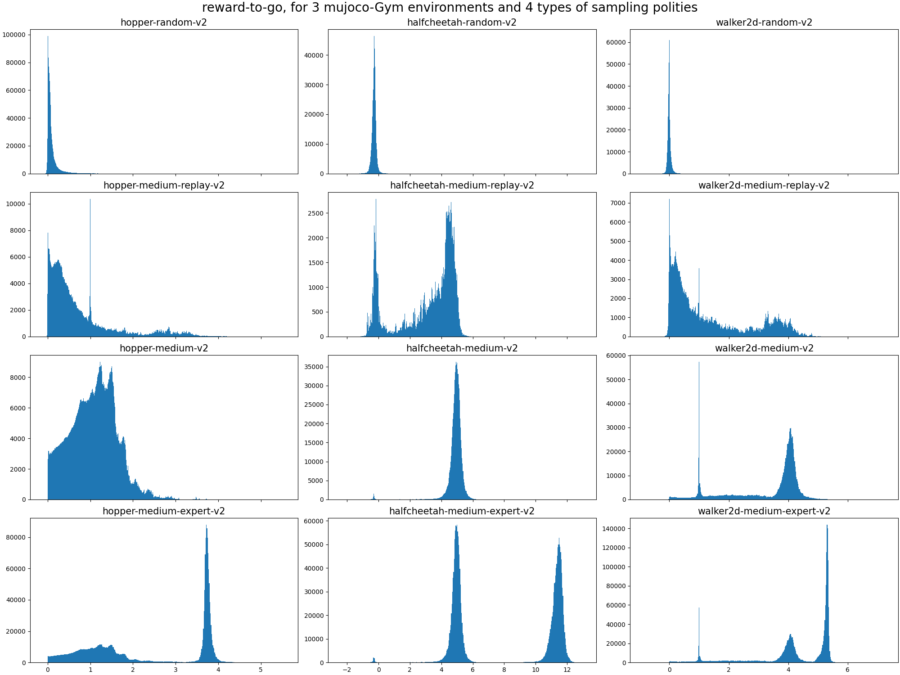
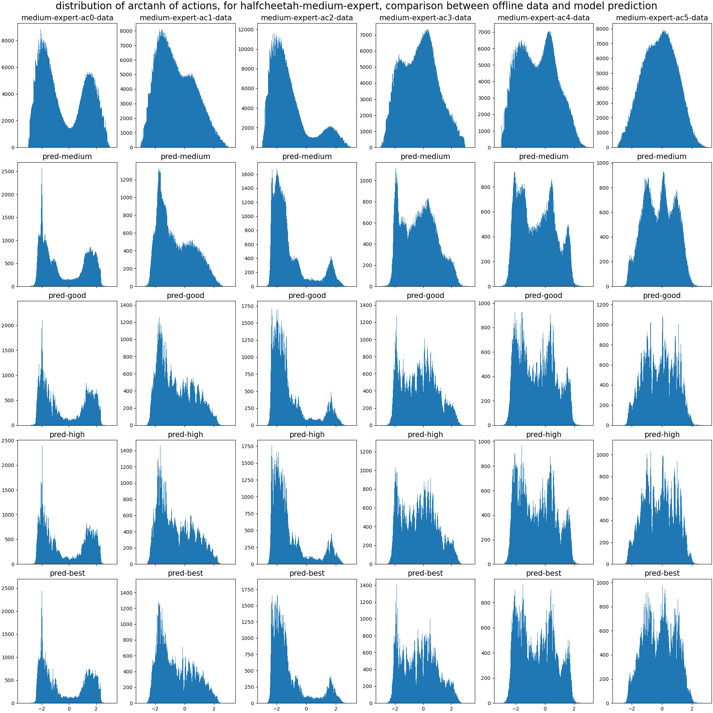

## Notes

DEF.

* benchmark: running the D4RL tasks for antmaze, gym.
*   Ignore the kitchen environments in D4RL. They cost a lot of compute.
*   Ignore the GCSL test suite. It's rarely used.

## replicate the RvS paper (part 1)

2022-12-05 21:19:03 Finally starting to do this thing.

First thing: got error in logging into Ubuntu. Turns out the VPN I installed changed WSL2 behavior. Fixed by `wsl2.reg` in [Winsock module breaks WSL2 · Issue #4177 · microsoft/WSL · GitHub](https://github.com/microsoft/WSL/issues/4177).

I'm using the Ubuntu env, because I don't want to deal with more dependency hell than necessary. It's well-known that the support for Windows is worse than for Linux.

Created `final` Conda env.

### Install mujoco

```bash
wget https://mujoco.org/download/mujoco210-linux-x86_64.tar.gz
tar -xvzf mujoco210-linux-x86_64.tar.gz
mkdir ~/.mujoco
mv mujoco210 ~/.mujoco/
echo 'export LD_LIBRARY_PATH=$LD_LIBRARY_PATH:/home/deadscholar/.mujoco/mujoco210/bin' >> ~/.bashrc
. ~/.bashrc
```

Test mujoco... success.

```python
import mujoco_py
# running build_ext
import os
mj_path = mujoco_py.utils.discover_mujoco()
xml_path = os.path.join(mj_path, 'model', 'humanoid.xml')
model = mujoco_py.load_model_from_path(xml_path)
sim = mujoco_py.MjSim(model)
print(sim.data.qpos)
# [0.  0.  1.4 1.  0.  0.  0.  0.  0.  0.  0.  0.  0.  0.  0.  0.  0.  0.
#  0.  0.  0.  0.  0.  0.  0.  0.  0.  0. ]
sim.step()
print(sim.data.qpos)
```

### install [D4RL](https://github.com/Farama-Foundation/D4RL)

D4RL requires `gym < 0.25.0`, and `gym 0.24.1` has "critical error" (why the hell didn't they just retract it??!), so I downgraded it to `pip install gym==0.23.1`. This incidentally also solved the `AttributeError: 'MazeEnv' object has no attribute 'sim'` problem... success.

The testing script ran with successful output:

```
Downloading dataset: http://rail.eecs.berkeley.edu/datasets/offline_rl/maze2d/maze2d-umaze-sparse-v1.hdf5 to /home/deadscholar/.d4rl/datasets/maze2d-umaze-sparse-v1.hdf5
load datafile: 100%|██████████████████████████████████████████████████████████████████████| 8/8 [00:00<00:00, 38.57it/s]
[[ 1.0856489   1.9745734   0.00981035  0.02174424]
 [ 1.0843927   1.97413    -0.12562364 -0.04433781]
 [ 1.0807577   1.9752754  -0.3634883   0.11453988]
 ...
 [ 1.1328583   2.8062387  -4.484303    0.09555068]
 [ 1.0883482   2.8068895  -4.4510083   0.06509537]
 [ 1.0463258   2.8074222  -4.202244    0.05324839]]
load datafile: 100%|██████████████████████████████████████████████████████████████████████| 8/8 [00:00<00:00, 38.32it/s]
```

D4RL downloads data into `~/.d4rl/datasets`. At run time it loads directly from there, into a dictionary of numpy arrays.


HDF5 is Hierarchical Data Format version 5. Basically a self-contained file directory, carrying its own directory structure metadata. It can be viewed by [HDF® View](https://www.hdfgroup.org/downloads/hdfview/?1670305643).

What does `maze2d-umaze-sparse-v1` look like? It's a set of numpy arrays, representing $10^6$ timesteps in the u-shaped 2d maze environment. It has sparse reward, meaning that it only gets reward +1 if it reaches the end.

The structure is as follows:

* observations: $o_t$
* actions: $a_t$
* rewards: $r_t$
* terminals: True at termination conditions, such as falling over. It should be called "truncation".
* timeouts: True when episodes end due to reaching the maximum episode length.
* infos: extra data that the agent does not have access to. These should not be used when training the agent.
    * goal: the goal location.
    * qpos: Lagrangian generalized position. Here, it is just $(x, y)$.
    * qvel: Lagrangian generalized velocity. Here, it is just $(v_x, v_y)$.

| name     | better name | meaning                                                                           |
|----------|-------------|-----------------------------------------------------------------------------------|
| timeout  | terminal    | Episode ends by reaching the goal state, or running out of time.                  |
| terminal | truncation  | Episode ends prematurely by a truncation condition, usually meaning falling down. |

I figured out what the difference is between `dataset = env.get_dataset()` and `dataset = d4rl.qlearning_dataset(env)`. The first imports the whole dataset in the form of $(o_t, a_t, r_t, info_t)$, while the second is in the form of $(o_t, a_t, r_t, o'_t, terminal_t, timeout_t)$. The second form is used for Q-learning (or other forms of TD learning), and throws away the terminal or truncation steps since they have no "subsequent step".

The [medatada for D4RL datasets](https://github.com/Farama-Foundation/D4RL/blob/master/d4rl/infos.py). What are those "-eval-"? They are datasets for "OPE" = "off-policy evaluation". Currently, however, off-policy evaluation is only implemented for HalfCheetah, Walker2d, Hopper. So we should ignore that!

### install [RvS](https://github.com/scottemmons/rvs).

```bash
conda activate final
git clone https://github.com/scottemmons/rvs.git
cd rvs
pip install -e .
```

Oh fucking hell, this code requires `Python < 3.9.0`. 

So I tried installing Docker. Then updated `wsl.exe --update`. Now WSL2 is fucked up. [Can't open wsl possibly after update "the data is invalid" · Issue #8826 · microsoft/WSL · GitHub](https://github.com/microsoft/WSL/issues/8826)

It's the Fucking VPN again. I FUCKING HATE Windows. Why the fuck do you use Winsock for WSL2???

[Error: "The stub received bad data" · Issue #7570 · microsoft/WSL · GitHub](https://github.com/microsoft/WSL/issues/7570)

Okay, so here's what to do:

```
> cd "C:\Program Files\WindowsApps\"

Search for some folder that looks like "MicrosoftCorporationII.WindowsSubsystemForLinux ... x64 ...". For me, it was "C:\Program Files\WindowsApps\MicrosoftCorporationII.WindowsSubsystemForLinux_1.0.0.0_x64__8wekyb3d8bbwe"

Go in and list its files. It should contain "wsl.exe" and "wslservice.exe".

Download https://web.archive.org/web/20220728095911/http://www.proxifier.com/tmp/Test20200228/NoLsp.exe

Open a windows terminal with admin priviledge.

Kill WSL with
> taskkill -IM "wslservice.exe" /F

Run NoLsp.exe on both "wsl.exe" and "wslservice.exe". For me, it was like
> .\NoLsp.exe "C:\Program Files\WindowsApps\MicrosoftCorporationII.WindowsSubsystemForLinux_1.0.0.0_x64__8wekyb3d8bbwe\wsl.exe"

> .\NoLsp.exe "C:\Program Files\WindowsApps\MicrosoftCorporationII.WindowsSubsystemForLinux_1.0.0.0_x64__8wekyb3d8bbwe\wslservice.exe"
```

The GPU is completely fucked up. I can't get WSL2 to use cuda anymore.

### Try again

Use Windows now, not WSL2.

Make an env with python 3.8.

```bash
conda create -n final38 python=3.8
conda activate final38
conda install pytorch==1.7.1 torchvision==0.8.2 torchaudio==0.7.2 cudatoolkit=11.0 -c pytorch
# Fail at box2d-py. Turns out swig is a requirement (even though it's not specified as a requirement!)
# https://github.com/openai/spinningup/issues/32
conda install -c anaconda swig
pip install -e .
```

It asks for installation of mujoco210, but Windows doesn't have it! It has only up to mujoco-1.5.0. I hope it would still work.

Download `mjpro150 win64` [here](https://www.roboti.us/download.html), and [mjkey.txt](https://www.roboti.us/file/mjkey.txt). Put `mjkey.txt` in `C:\Users\DeadScholar\.mujoco\mjpro150\bin`, and `C:\Users\DeadScholar\.mujoco\`.

Add `C:\Users\DeadScholar\.mujoco\mjpro150\bin` to environment variable `PATH`.

Test installation

```bash
cd "C:\Users\DeadScholar\.mujoco\mjpro150\bin"
simulate.exe ../model/humanoid.xml
```

Success.

Install `pip install -U 'mujoco-py<1.50.2,>=1.50.1'`... Fail. For some fucking reason it doesn't work because "file name or extention too long"????

Directly downloaded the [source code of mujoco-py==1.50.1.0](https://github.com/openai/mujoco-py/releases). Decompressed. Went in the folder, `python setup.py install`.

Ran it, still got "file name or extension too long".

Attempting to deal with this by enabling long filename. [Maximum Path Length Limitation - Win32 apps | Microsoft Learn](https://learn.microsoft.com/en-us/windows/win32/fileio/maximum-file-path-limitation?tabs=registry#enable-long-paths-in-windows-10-version-1607-and-later). Then reboot...

After reboot, WSL2 suddenly can detect GPU again. What the fuck.

Anyway, time to use WSL2 for GPU.

My GPU is A5500, which requires architecture 8.6 (whatever the fuck that means). This can't be done with torch 1.7.1. So I upgraded to `1.12.1`, with `conda install pytorch=1.12.1 torchvision=0.13.1 torchaudio=0.12.1 cudatoolkit=11.6 -c pytorch -c conda-forge`...

and that breaks `rlutil`. Is ANYONE around to update this crap??

Fuck that!! `rlutil` is used only for [Goal-conditional Supervised Learning](https://github.com/dibyaghosh/gcsl/). Fuck it!!! I'll comment out all mentions of `gcsl` in the code!!!

Well! Now it only takes 36 minutes to complete a run. 6 times faster!

What the fuck? After a restart, now LLVM is broken with `ImportError: /lib/x86_64-linux-gnu/libLLVM-12.so.1: undefined symbol: ffi_type_sint32, version LIBFFI_BASE_7.0`!!! 

Reinstalling [LLVM Debian/Ubuntu packages](https://apt.llvm.org/)... useless! 

Fully deleted miniconda3 folder. Reinstalled miniconda.

```bash
D4RL_SUPPRESS_IMPORT_ERROR=1
echo $D4RL_SUPPRESS_IMPORT_ERROR
```

## use AutoGluon

Oh fucking hell, now jupyter notebook is broken... but only for WSL2! What the fuck? Everything is fucked up ever since I started using VPN...

Also another fucking hassle

*   install [AutoGluon](https://github.com/autogluon/autogluon)

`pip install autogluon`


*   [Train a predictor.](https://auto.gluon.ai/stable/tutorials/tabular_prediction/tabular-quickstart.html)
*   Convert the predictor into a policy. Benchmark.

## Get training data 

* reverse-engineer the experiment [scripts](https://github.com/scottemmons/rvs/tree/main/experiments), to find out what kind of offline training data is generated.

* Write to csv files

Table of methods used in the RvS paper (Table 1 of the [RvS paper](https://arxiv.org/pdf/2112.10751.pdf)): 

|            | RvS-R | RvS-G             | other methods |
|------------|-------|-------------------|---------------|
| AntMaze    | yes   | `xy_conditioning` | yes           |
| mujoco Gym | yes   | no                | yes           |

For the mujoco Gym tasks, D4RL contains (hopper, half-cheetah, walker2d) $\times$ (random, medium, medium-replay, medium-expert). Each is a 1-million-step dataset, generated by different policies:

* “random”: randomly initialized policy.
* “medium”: train a policy online using Soft Actor-Critic, but early-stop it.
* "medium-replay": recording all samples in the replay buffer observed during training until the policy reaches the “medium” level of performance.
* “medium-expert”: half from an expert policy, half from a suboptimal policy (either partially trained policy uniform-at-random).

RvS-R is switched on by this like in the config file: `reward_conditioning = True`.

In this repo, RvS-G is only implemented for the AntMaze environment with goal space $(x, y)$. Consequently, it is called `xy_conditioning`. It is not explicitly specified, but rather as this little piece of logic, in [`policies.py` line 106](https://github.com/scottemmons/rvs/blob/main/src/rvs/policies.py#L106):

```python
xy_conditioning = (
            env_name in step.d4rl_antmaze
            and not unconditional_policy
            and not reward_conditioning
        )
```

Okay, which dataset to use first? Well, Table 1 of RvS paper shows these results for offline RL on the mujoco Gym environments.

| dataset       | normalized score |
|---------------|------------------|
| random        | ~5               |
| medium-replay | ~60              |
| medium        | ~60              |
| medium-expert | ~100             |

How big are the datasets? Well, each dataset contains on the order of 1 million timesteps. More precisely:

| dataset       | halfcheetah | hopper | walker2d |
|---------------|-------------|--------|----------|
| random        | 1           | 1      | 1        |
| medium-replay | 0.2         | 0.4    | 0.3      |
| medium        | 1           | 1      | 1        |
| medium-expert | 2           | 2      | 2        |

and the environments that RvS-R can handle are: "halfcheetah-medium-replay-v2", "halfcheetah-medium-expert-v2","hopper-medium-replay-v2", "hopper-medium-expert-v2", "walker2d-medium-replay-v2", "walker2d-medium-expert-v2".

Looks like we should start with `medium` and `medium-expert`.

```python
import h5py
import numpy as np
import gym

# Create the environment
env = gym.make('halfcheetah-medium-v2')

# d4rl abides by the OpenAI gym interface
env.reset()
env.step(env.action_space.sample())

dataset = env.get_dataset()
# dataset = d4rl.qlearning_dataset(env)

print(dataset.keys())

print("\nobservations: shape", dataset['observations'].shape)
print(dataset['observations']) # An (N, dim_observation)-dimensional numpy array of observations

print("\nactions: shape", dataset['actions'].shape)
print(dataset['actions']) # An (N, dim_action)-dimensional numpy array of actions

print("\nrewards: shape", dataset['rewards'].shape)
print(dataset['rewards']) # An (N,)-dimensional numpy array of rewards

print("\nalgorithms:", dataset['metadata/algorithm'])
print("\nmetadata/iteration:", dataset['metadata/iteration'])
print("\nterminals:", dataset['terminals'].sum())
print("\ntimeouts:", dataset['timeouts'].sum())
```

Download dataset... done. I got the 12 datasets tabulated above. Taking up 2.5 GB.

Load the datasets into AutoGluon. We start with halfcheetah-medium and halfcheetah-medium-expert.

Okay, let's try to at least match RvS-R. What kind of input data does RvS-R have? Well, the paper says the RvS-R policy is of type $\pi(a_t| s_t, \omega_t)$ where $\omega_t = \frac{1}{H-t+1}\sum_{t'=t}^H r_{t'}$ where $H$ is a fixed episode length (the episode boundaries are described as "timeout").

But we know better than to trust their own judgment. Only code will do. Talk is cheap, but code is law.

So let's dig into the codes for `reward_conditioning`.

```python
# policies.py:
def make_obs_goal_space(
    observation_space: gym.Space,
    unconditional_policy: bool = False,
    reward_conditioning: bool = False,
    xy_conditioning: bool = False,
) -> gym.Space:
    if sum([unconditional_policy, reward_conditioning, xy_conditioning]) > 1:
        raise ValueError("You must choose at most one policy conditioning setting.")
    if unconditional_policy:
        return observation_space
    elif reward_conditioning: # adds 1 scalar: average reward for the rest of the episode.
        return util.add_scalar_to_space(observation_space)
    elif xy_conditioning: # adds 2 scalars: the goal state (x, y).
        return util.add_scalar_to_space(util.add_scalar_to_space(observation_space))
    else:
        return util.create_observation_goal_space(observation_space)

# dataset.py
def create_data_module(...) -> AbstractDataModule:
    """Creates the data module used for training."""
    if unconditional_policy and reward_conditioning:
        raise ValueError("Cannot condition on reward with an unconditional policy.")

    if env_name in step.d4rl_env_names:
        if unconditional_policy:
            data_module = D4RLBCDataModule(
                env,
                batch_size=batch_size,
                val_frac=val_frac,
                seed=seed,
            )
        elif reward_conditioning:
            data_module = D4RLRvSRDataModule(
                env,
                batch_size=batch_size,
                val_frac=val_frac,
                average_reward_to_go=average_reward_to_go,
                seed=seed,
            )

...

class D4RLRvSRDataModule(D4RLTensorDatasetDataModule):
    """Data module for RvS-R (reward-conditioned) learning in D4RL."""

    def __init__(
        self,
        env: offline_env.OfflineEnv,
        batch_size: int,
        val_frac: float = 0.1,
        num_workers: Optional[int] = None,
        average_reward_to_go: bool = True,
        seed: Optional[int] = None,
    ):
        """Custom initialization that sets the average_reward_to_go."""
        super().__init__(
            env,
            batch_size,
            val_frac=val_frac,
            num_workers=num_workers,
            seed=seed,
        )
        self.average_reward_to_go = average_reward_to_go

    def _get_observation_tensor(self, dataset: Dict[str, np.ndarray]) -> torch.Tensor:
        return make_s_g_tensor(
            dataset["observations"],
            reward_to_go(dataset, average=self.average_reward_to_go).reshape(-1, 1),
        )

...

def reward_to_go(dataset: Dict[str, np.ndarray], average: bool = True) -> np.ndarray:
    """Compute the reward to go for each timestep.

    The implementation is iterative because when I wrote a vectorized version, np.cumsum
    cauased numerical instability.
    """
    dones = np.logical_or(dataset["terminals"], dataset["timeouts"])
    _, _, lengths = util.extract_done_markers(dones)
    max_episode_steps = np.max(lengths)

    reverse_reward_to_go = np.inf * np.ones_like(dataset["rewards"])
    running_reward = 0
    for i, (reward, done) in enumerate(zip(dataset["rewards"][::-1], dones[::-1])):
        if done:
            running_reward = 0
        running_reward += reward
        reverse_reward_to_go[i] = running_reward
    cum_reward_to_go = reverse_reward_to_go[::-1].copy()

    avg_reward_to_go = np.inf * np.ones_like(cum_reward_to_go)
    elapsed_time = 0
    for i, (cum_reward, done) in enumerate(zip(cum_reward_to_go, dones)):
        avg_reward_to_go[i] = cum_reward / (max_episode_steps - elapsed_time)
        elapsed_time += 1
        if done:
            elapsed_time = 0

    return avg_reward_to_go if average else cum_reward_to_go
```

Found the code: it's `reward_to_go(dataset: Dict[str, np.ndarray], average: bool = True) -> np.ndarray` in `rvs/dataset.py`.

Got it working! The diagram is pretty.



2022-12-09 02:09:43 Ah yes, I curse the heavens above that I live another day.

Now we return to AutoGluon. 

Ignore [Demo RL Searcher — AutoGluon Documentation 0.4.3 documentation](https://auto.gluon.ai/dev/tutorials/nas/rl_searcher.html). It is just a LSTM used as a scheduler (the program that picks the next classifier to use). It is not AutoGluon applied *to* RL, but RL applied *to* AutoGluon.


Got the csv files exported. and ready for RvS-R They are formatted like `ob0, ob1, ob2, ob3, ob4, ob5, ob6, ob7, ob8, ob9, ob10, ac0, ac1, ac2, rtg` (rtg = reward-to-go).

Runnnig AutoGluon.

```python
import autogluon
from autogluon.tabular import TabularDataset, TabularPredictor

from autogluon.tabular import TabularDataset, TabularPredictor
from autogluon.common.utils.utils import setup_outputdir
from autogluon.core.utils.loaders import load_pkl
from autogluon.core.utils.savers import save_pkl
import os.path

class MultilabelPredictor():
    multi_predictor_file = 'multilabel_predictor.pkl'

    def __init__(self, labels, path=None, problem_types=None, eval_metrics=None, consider_labels_correlation=True, **kwargs):
        if len(labels) < 2:
            raise ValueError("MultilabelPredictor is only intended for predicting MULTIPLE labels (columns), use TabularPredictor for predicting one label (column).")
        if (problem_types is not None) and (len(problem_types) != len(labels)):
            raise ValueError("If provided, `problem_types` must have same length as `labels`")
        if (eval_metrics is not None) and (len(eval_metrics) != len(labels)):
            raise ValueError("If provided, `eval_metrics` must have same length as `labels`")
        self.path = setup_outputdir(path, warn_if_exist=False)
        self.labels = labels
        self.consider_labels_correlation = consider_labels_correlation
        self.predictors = {}  # key = label, value = TabularPredictor or str path to the TabularPredictor for this label
        if eval_metrics is None:
            self.eval_metrics = {}
        else:
            self.eval_metrics = {labels[i] : eval_metrics[i] for i in range(len(labels))}
        problem_type = None
        eval_metric = None
        for i in range(len(labels)):
            label = labels[i]
            path_i = self.path + "Predictor_" + label
            if problem_types is not None:
                problem_type = problem_types[i]
            if eval_metrics is not None:
                eval_metric = eval_metrics[i]
            self.predictors[label] = TabularPredictor(label=label, problem_type=problem_type, eval_metric=eval_metric, path=path_i, **kwargs)

    def fit(self, train_data, tuning_data=None, **kwargs):
        if isinstance(train_data, str):
            train_data = TabularDataset(train_data)
        if tuning_data is not None and isinstance(tuning_data, str):
            tuning_data = TabularDataset(tuning_data)
        train_data_og = train_data.copy()
        if tuning_data is not None:
            tuning_data_og = tuning_data.copy()
        else:
            tuning_data_og = None
        save_metrics = len(self.eval_metrics) == 0
        for i in range(len(self.labels)):
            label = self.labels[i]
            predictor = self.get_predictor(label)
            if not self.consider_labels_correlation:
                labels_to_drop = [l for l in self.labels if l != label]
            else:
                labels_to_drop = [self.labels[j] for j in range(i+1, len(self.labels))]
            train_data = train_data_og.drop(labels_to_drop, axis=1)
            if tuning_data is not None:
                tuning_data = tuning_data_og.drop(labels_to_drop, axis=1)
            print(f"Fitting TabularPredictor for label: {label} ...")
            predictor.fit(train_data=train_data, tuning_data=tuning_data, **kwargs)
            self.predictors[label] = predictor.path
            if save_metrics:
                self.eval_metrics[label] = predictor.eval_metric
        self.save()

    def predict(self, data, **kwargs):
        return self._predict(data, as_proba=False, **kwargs)

    def predict_proba(self, data, **kwargs):
        return self._predict(data, as_proba=True, **kwargs)

    def evaluate(self, data, **kwargs):
        data = self._get_data(data)
        eval_dict = {}
        for label in self.labels:
            print(f"Evaluating TabularPredictor for label: {label} ...")
            predictor = self.get_predictor(label)
            eval_dict[label] = predictor.evaluate(data, **kwargs)
            if self.consider_labels_correlation:
                data[label] = predictor.predict(data, **kwargs)
        return eval_dict

    def save(self):
        """ Save MultilabelPredictor to disk. """
        for label in self.labels:
            if not isinstance(self.predictors[label], str):
                self.predictors[label] = self.predictors[label].path
        save_pkl.save(path=self.path+self.multi_predictor_file, object=self)
        print(f"MultilabelPredictor saved to disk. Load with: MultilabelPredictor.load('{self.path}')")

    @classmethod
    def load(cls, path):
        """ Load MultilabelPredictor from disk `path` previously specified when creating this MultilabelPredictor. """
        path = os.path.expanduser(path)
        if path[-1] != os.path.sep:
            path = path + os.path.sep
        return load_pkl.load(path=path+cls.multi_predictor_file)

    def get_predictor(self, label):
        """ Returns TabularPredictor which is used to predict this label. """
        predictor = self.predictors[label]
        if isinstance(predictor, str):
            return TabularPredictor.load(path=predictor)
        return predictor

    def _get_data(self, data):
        if isinstance(data, str):
            return TabularDataset(data)
        return data.copy()

    def _predict(self, data, as_proba=False, **kwargs):
        data = self._get_data(data)
        if as_proba:
            predproba_dict = {}
        for label in self.labels:
            print(f"Predicting with TabularPredictor for label: {label} ...")
            predictor = self.get_predictor(label)
            if as_proba:
                predproba_dict[label] = predictor.predict_proba(data, as_multiclass=True, **kwargs)
            data[label] = predictor.predict(data, **kwargs)
        if not as_proba:
            return data[self.labels]
        else:
            return predproba_dict
```

```python
exp_name = "halfcheetah-medium-v2"
original_train_data = TabularDataset('{name}.csv'.format(name=exp_name))
original_train_data.head()

excluded_model_types = ['KNN']

train_data = original_train_data.sample(n=100000, random_state=0)
multi_predictor = MultilabelPredictor(labels=labels,
                                      problem_types=problem_types,
                                      eval_metrics=eval_metrics,
                                      path=save_path)
multi_predictor.fit(train_data, 
                    time_limit=600,
                    presets = ['medium_quality'],      
                    excluded_model_types=['KNN'],
                    num_gpus=1)
```

We noticed that k-nearest-neighbor runs extremely slowly, and its validation error is 3x larger than the other methods. Consequently, we excluded it.

Now create the test set... wait a minute, there is no test set! Yeah, it's not that surprising. After all, if we are doing RL, the proof is in the ~~pudding~~ doing. Instead of train-validate-test, we got train-validate-run it for real.

## Test the trained by the AutoGluon

We have a problem here: each action output should be in the range [-1, +1], but AutoGluon does not offer any way to constrain numerical outputs. After fiddling with the dataset, I found that the dataset is actuall created by a neural network with `tanh` head in the end. So what I did is to apply `np.arctanh(0.995 * x)` to the actions, use AutoGluon to learn that, then apply `np.clip(np.tanh(y) / 0.995, -1.0, 1.0)` to recover actions. This should work alright!

If model is too large, then use `predictor.clone_for_deployment(path="...")`

If inference is too slow, then distill

```python
student_models = predictor.distill(time_limit=30)  # specify much longer time limit in real applications
print(student_models)
preds_student = predictor.predict(test_data_nolabel, model=student_models[0])
print(f"predictions from {student_models[0]}:", list(preds_student)[:5])
predictor.leaderboard(test_data)
```


## Okay, experiment time

Trained 4 predictors out of `halfcheetah-medium-expert-v2`, one for each AutoGluon quality setting, and each for 2 hours. The table of average L2 loss for each action dimension is as follows.

|        |      ac0 |      ac1 |      ac2 |      ac3 |      ac4 |      ac5 |
|--------|----------|----------|----------|----------|----------|----------|
| medium | 0.203319 | 0.174317 | 0.201113 | 0.152283 | 0.163099 | 0.189098 |
| good   | 0.220616 | 0.188009 | 0.213779 | 0.167066 | 0.177785 | 0.201476 |
| high   | 0.219693 | 0.187197 | 0.214508 | 0.167088 | 0.177537 | 0.201598 |
| best   | 0.21679  | 0.184454 | 0.210596 | 0.16318  | 0.174045 | 0.199378 |

and the diagram of action distributions is as follows



Both the L2 loss and the action distributions show that with just 2 hours of training budget, the best quality setting is medium.

Given that, we proceeded to train a medium-quality AutoGluon classifier for each of the 3 environmens and 4 datasets, taking 24 hours... Done.

### digging out the benchmark

`Sampling trajectory rewards: 100%|████████████████████████████████████████████████████| 200/200 [01:02<00:00,  3.22it/s]`

```python

# visualize.py

from wandb.sdk.wandb_run import Run

def get_performance_vec(checkpoint_file, ...) -> np.ndarray:
    """Load the policy checkpoint and sample its performance."""
    performance_file, _ = os.path.splitext(checkpoint_file)
    if not force_rollouts:
            performance_vec = np.load(performance_file + ".npy")
    else:
        policy = policies.RvS.load_from_checkpoint(...) # load policy
        performance_vec = step.sample_episode_performance(...) 

        np.save(performance_file, performance_vec)
        save_file_to_wandb(performance_file, wandb_run=wandb_run)

    return performance_vec

def get_performance_vecs(checkpoints, ...) -> List[np.ndarray]:
    return [get_performance_vec(checkpoint_file, ...) for checkpoint_file in checkpoints]

def visualize_performance(
    device: torch.device, # GPU or CPU
    trajectory_samples: int = 2000, # How many trajectories to use?
    force_rollouts: bool = False, # Create new rollouts?
    kitchen_subtask: str = "all", # ignore
    out_directory: str,   # Load policy, save image to this local folder
    wandb_run: Optional[Run] = None, # Save image to this wandb run 
) -> None:
    """Visualize the performance: hitting times for GCSL, and reward for D4RL."""
    util.load_experiment(out_directory, last_checkpoints_too) # returns some strings, floats, ints.
    get_performance_vecs(...) # loads policy, rollout policy, returns reward trajectories
    visualize_cumulative_reward(...) # make and save violin plots of reward trajectories

def visualize_cumulative_reward(
    reward_vecs: Union[np.ndarray, List[np.ndarray]], # The working bit.
    attribute_dicts: List[Dict[str, Union[int, float, str]]], # The working bit.

    parameters: Dict[str, Union[int, float, str, bool]], # We only need to extract the env name here.
    # as lower_env_name = parameters["env_name"].lower() 
    x: str = "Checkpoint", y: str = "Return", hue: str = "Checkpoint", title: Optional[str] = None,
    file_tag: str = "Iter", # filename prefix
    out_directory: str, # Save image to this local folder
    wandb_run: Optional[Run] = None, # Save image to this wandb run 
) -> None:
    """Create a violin plot of the rewards, save to local image and to wandb.
       Save DataFrame as local csv and wandb table."""

    df = aggregate_performance(reward_vecs, attribute_dicts, performance_metric=y) 
    # Combine the performance vectors and their attributes into one DataFrame.
    sns.violinplot(x=x, y=y, hue=hue, data=df)
    ...
    plt_filename = os.path.join(out_directory, f"{lower_env_name}_{lower_file_tag}_reward_violin.png")
    plt.savefig(plt_filename)
    log_plt_as_image(f"{file_tag.lower()}_reward_violin", wandb_run=wandb_run)
    plt.close()

    save_df_with_plot(df, plt_filename, wandb_run=wandb_run, wandb_table_key=f"{file_tag.lower()}_reward_table")
    # Save DataFrame as local csv and wandb table

# step.py

def sample_episode_performance(
    policy,
    env: Union[GCSLToGym, offline_env.OfflineEnv], env_name: str,
    max_episode_steps: int, traj_samples: int = 2000,
    ...
) -> np.ndarray:
    """Helper function to sample episode performance correctly, depending on the env."""
    if env_name[:7] == "kitchen": ...
    elif env_name in d4rl_env_names:
        return sample_cumulative_reward(policy, env, trajectory_samples=traj_samples)
    else: ...

def sample_cumulative_reward(...): # similar to sample_with_reward_conditioning

# cumulative reward with RvS-R policy
def sample_with_reward_conditioning(
    policy: Union[policies.RvS, Callable[[np.ndarray, np.ndarray], np.ndarray]],
    env: gym.Env,
    reward_target: Union[int, float],
    trajectory_samples: int = 200,
) -> np.ndarray:
    total_reward_vec = []
    for _ in tqdm.trange(trajectory_samples, desc="Sampling trajectory rewards"):
        total_reward = 0
        observation = env.reset()
        done = False
        while not done: ... action = get_action_from_policy(policy, observation, goal) ...
        total_reward_vec.append(total_reward)

    total_rewards = np.array(total_reward_vec)
    return total_rewards

def get_action_from_policy(...) -> np.ndarray:
    """Helper function to get action from multiple types of policies."""
    try:                   return policy.get_action(obs, goal) 
    except AttributeError: return policy(obs, goal)
```

You know what? Fuck it all. The dependency hell is too deep. It's much cheaper to just roll my own functions!

### Now get the model inference down to a fast enough level for inference

Loading time: 8 seconds per model. It takes up almost no space in RAM, so it should be alright.

2000 datapoints take 1 second to infer (for persisted models). Each episode is 1000 steps long, so it takes 1000 seconds per model per action-dimension.

There are 4 * (6 + 3 + 6) = 60 models, giving... 60000 seconds. Well fuck.

