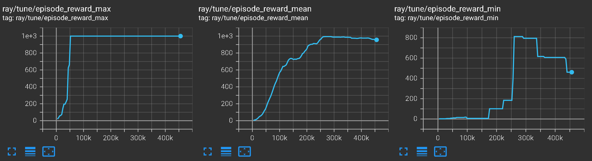
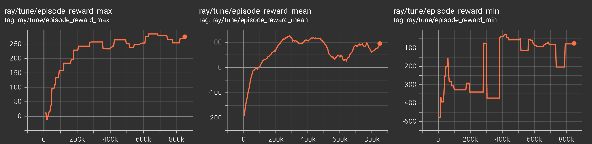
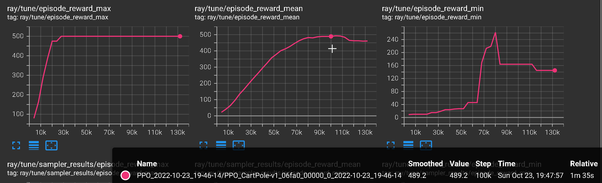
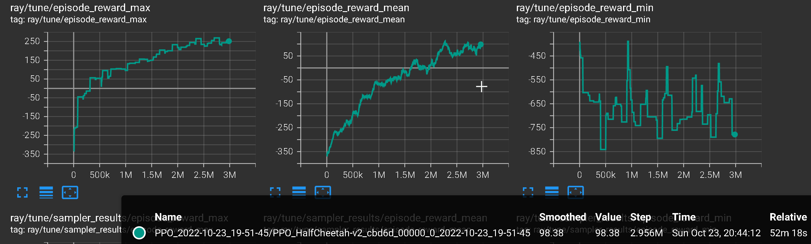

# Midterm Experiment Logs

## Getting the thing working

PPO is working now.


```python
tune.run(PPOTrainer, config={
   "env": "InvertedPendulum-v2",
   "framework": "torch",
   "log_level": "INFO",
    "num_gpus": 0
})
# 7.25 sec/iter for "num_gpus" : 1
# 4 sec/iter for "num_gpus" : 0
```


||
|:--:|
| <b>`PPO_2022-10-23_19-22-32/PPO_InvertedPendulum-v2_b6f65_00000_0_2022-10-23_19-22-32`</b>|

```python
tune.run(PPOTrainer, config={
   "env": "LunarLander-v2",
   "framework": "torch",
   "log_level": "INFO",
    "num_gpus": 0
})
# 8 sec/iter for "num_gpus" : 1
# 4.5 sec/iter for "num_gpus" : 0
```


||
|:--:|
| <b>`PPO_2022-10-23_18-24-18/PPO_LunarLander-v2_94a2f_00000_0_2022-10-23_18-24-18`</b>|

```python
tune.run(PPOTrainer, config={
   "env": "CartPole-v1",
   "framework": "torch",
   "log_level": "INFO",
    "num_gpus": 0
})
```

||
|:--:|
| <b>`PPO_2022-10-23_17-17-50/PPO_CartPole-v1_4b8b5_00000_0_2022-10-23_17-17-50`</b>|


```python
tune.run(PPOTrainer, config={
   "env": "HalfCheetah-v2",
   "framework": "torch",
   "log_level": "INFO",
    "num_gpus": 0
})
# 4.2 sec/iter
```


||
|:--:|
| <b>`PPO_2022-10-23_19-51-45/PPO_HalfCheetah-v2_cbd6d_00000_0_2022-10-23_19-51-45`</b>|


| method | env                 | steps | time  | performance |
|--------|---------------------|-------|-------|-------------|
| PPO    | CartPole-v1         | 100k  | 95s   | 500         |
|        | LunarLander-v2      | 450k  | 600s  | 120+-160    |
|        | InvertedPendulum-v2 | 270k  | 260s  | 995         |
|        | HalfCheetah-v2      | 3000k | 3120s | 90          |
|        |                     |       |       |             |

## Other ideas

(Stochastic) Deep Sea exploration (the two exploration-testing env in the [`bsuite`](https://github.com/deepmind/bsuite)).

 