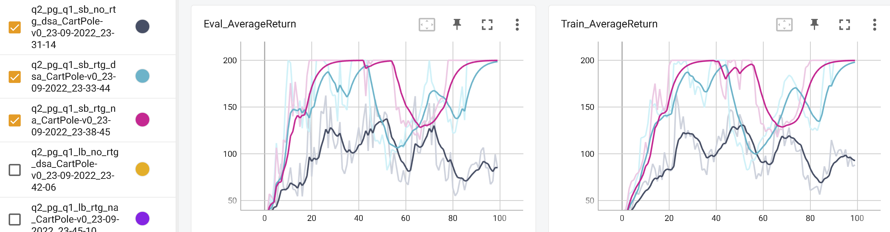
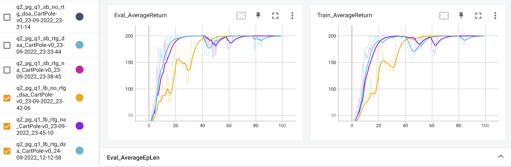
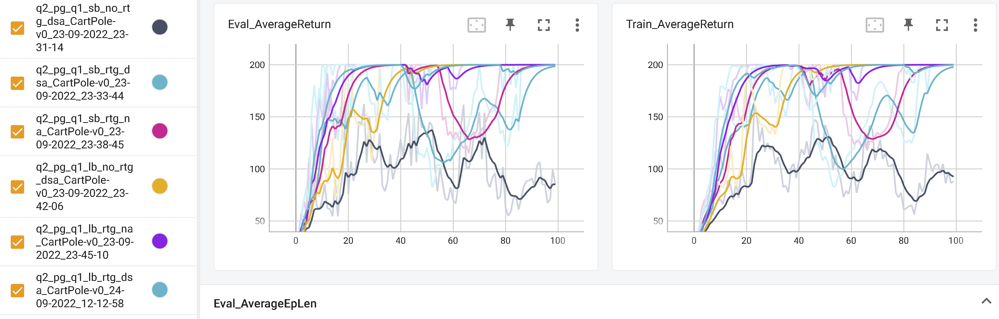
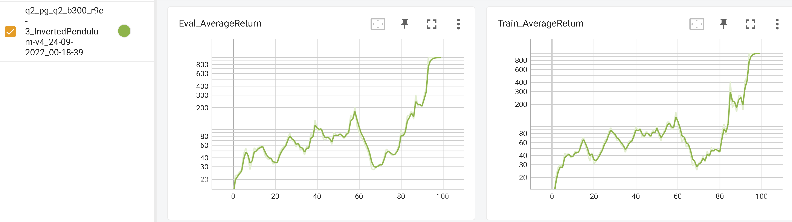
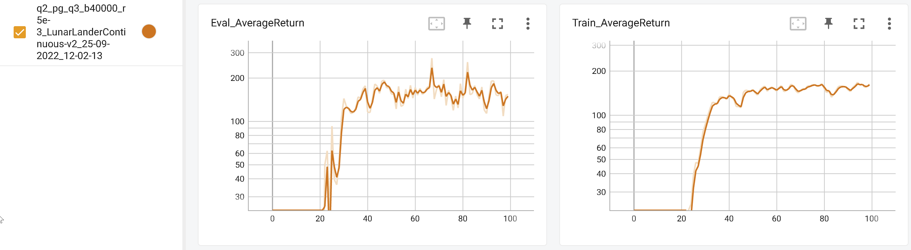
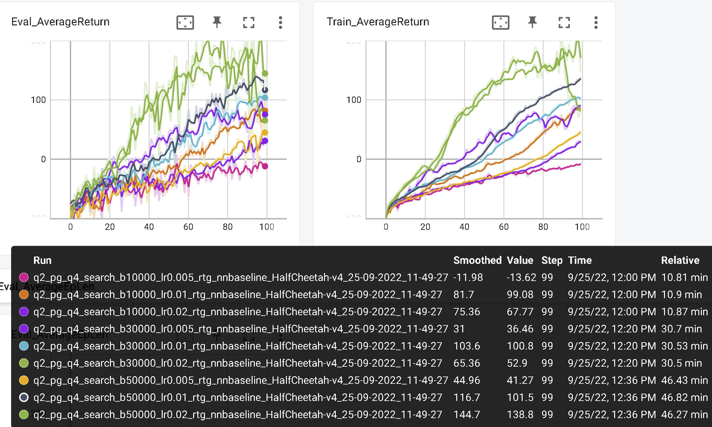
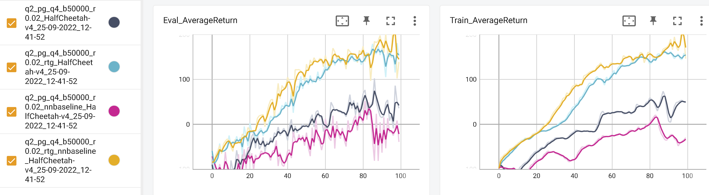
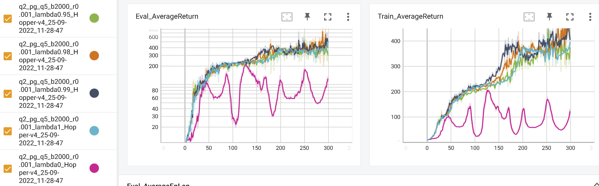
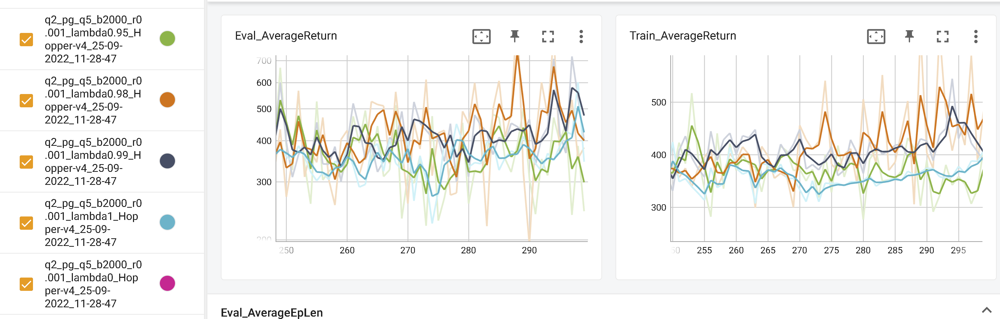

# Experiment logs

## Meaning of flags

* `-n` : Number of iterations.
* `-b` : Batch size (number of state-action pairs sampled while acting according to the current policy at each iteration).
* `-dsa` : Flag: if present, sets standardize_advantages to False. Otherwise, by default, standardizes advantages to have a mean of zero and standard deviation of one.
* `-rtg` : Flag: if present, sets reward_to_go=True. Otherwise, reward_to_go=False by default.
* `--exp_name` : Name for experiment, which goes into the name for the data logging directory.

## Small-Scale Experiments

### Experiment 1 (CartPole-v0)

Run multiple experiments with the PG algorithm on the discrete CartPole-v environment, using the following script `python .\cs285\scripts\exp_1_1.py`.

```python
import shlex, subprocess

commands = []
commands.append("python cs285/scripts/run_hw2.py --env_name CartPole-v0 -n 100 -b 1000 -dsa --exp_name q1_sb_no_rtg_dsa")
commands.append("python cs285/scripts/run_hw2.py --env_name CartPole-v0 -n 100 -b 1000 -rtg -dsa --exp_name q1_sb_rtg_dsa")
commands.append("python cs285/scripts/run_hw2.py --env_name CartPole-v0 -n 100 -b 1000 -rtg --exp_name q1_sb_rtg_na")
commands.append("python cs285/scripts/run_hw2.py --env_name CartPole-v0 -n 100 -b 5000 -dsa --exp_name q1_lb_no_rtg_dsa")
commands.append("python cs285/scripts/run_hw2.py --env_name CartPole-v0 -n 100 -b 5000 -rtg -dsa --exp_name q1_lb_rtg_dsa")
commands.append("python cs285/scripts/run_hw2.py --env_name CartPole-v0 -n 100 -b 5000 -rtg --exp_name q1_lb_rtg_na")

if __name__ == "__main__":
    for command in commands:
        args = shlex.split(command)
        subprocess.Popen(args)
```

Successful. The experiment data are put into

```
q2_pg_q1_sb_no_rtg_dsa_CartPole-v0_23-09-2022_23-31-14
q2_pg_q1_sb_rtg_dsa_CartPole-v0_23-09-2022_23-33-44
q2_pg_q1_sb_rtg_na_CartPole-v0_23-09-2022_23-38-45
q2_pg_q1_lb_no_rtg_dsa_CartPole-v0_23-09-2022_23-42-06
q2_pg_q1_lb_rtg_dsa_CartPole-v0_24-09-2022_12-12-58
q2_pg_q1_lb_rtg_na_CartPole-v0_23-09-2022_23-45-10
```

Explanation of hyperparameters:

* `b`: batch size, with `sb` meaning "small batch" (10000), and `lb` meaning "large batch" (50000).
* `rtg`: reward to go
* `dsa`: advantage standardization

||
|:--:|
| <b>Fig 1.1. Learning curves for the experiments prefixed with `q_sb_`. They are the small batch experiments, with batch size 1000.</b>|

||
|:--:|
| <b>Fig 1.2. Learning curves for the experiments prefixed with `q_lb_`. They are the large batch experiments, with batch size 5000.</b>|

||
|:--:|
| <b>Fig 1.3. Learning curves for both the small and large batch experiments.</b>|

We can see from the graphs that:

* Using reward-to-go significantly made early learning faster. For the small batch, no-rtg could not even reach the plateau. For the large batch, rtg reached the plateau at step 20 while no-rtg reached it at step 60.
* For small batch, advantage standardization made early learning a little faster, but failed to reach the plateau stably. For large batch, it also made early learning faster, and the plateau was also stable.
* A larger batch size always helps, for all other hyperparameter settings (reward to go, advantage standardization). It makes learning faster, and suffers less catastrophic collapses.


### Experiment 2 (InvertedPendulum-v4)

Run experiments on the InvertedPendulum-v4 continuous control environment, starting with the defaults:

* batch size = 1000
* learning rate = 5e-3

and then doing manual grid search around that.

```bash
# default setting -- optimum (1000) around iteration 92
python cs285/scripts/run_hw2.py --env_name InvertedPendulum-v4 --ep_len 1000 --discount 0.9 -n 100 -l 2 -s 64 -b 1000 -lr 5e-3 -rtg --exp_name q2_b1000_r5e-3

# trying higher learning rate -- total collapse at iteration 80.
python cs285/scripts/run_hw2.py --env_name InvertedPendulum-v4 --ep_len 1000 --discount 0.9 -n 100 -l 2 -s 64 -b 1000 -lr 5e-2 -rtg --exp_name q2_b1000_r5e-2

# trying lower leawing rate -- did not reach convergence
python cs285/scripts/run_hw2.py --env_name InvertedPendulum-v4 --ep_len 1000 --discount 0.9 -n 100 -l 2 -s 64 -b 1000 -lr 5e-4 -rtg --exp_name q2_b1000_r5e-4

# trying less batch -- converged around iteration 80, but then it suddenly forgot how to play around iter 90
python cs285/scripts/run_hw2.py --env_name InvertedPendulum-v4 --ep_len 1000 --discount 0.9 -n 100 -l 2 -s 64 -b 500 -lr 5e-3 -rtg --exp_name q2_b500_r5e-3

# trying higher learning rate -- it worked!
python cs285/scripts/run_hw2.py --env_name InvertedPendulum-v4 --ep_len 1000 --discount 0.9 -n 100 -l 2 -s 64 -b 500 -lr 9e-3 -rtg --exp_name q2_b500_r9e-3

# trying higher learning rate -- failure
python cs285/scripts/run_hw2.py --env_name InvertedPendulum-v4 --ep_len 1000 --discount 0.9 -n 100 -l 2 -s 64 -b 500 -lr 5e-2 -rtg --exp_name q2_b500_r5e-2

# trying lower batch size -- somehow, it worked?
python cs285/scripts/run_hw2.py --env_name InvertedPendulum-v4 --ep_len 1000 --discount 0.9 -n 100 -l 2 -s 64 -b 300 -lr 9e-3 -rtg --exp_name q2_b300_r9e-3

# trying lower batch size -- failure
python cs285/scripts/run_hw2.py --env_name InvertedPendulum-v4 --ep_len 1000 --discount 0.9 -n 100 -l 2 -s 64 -b 100 -lr 9e-3 -rtg --exp_name q2_b100_r9e-3

# trying higher lr -- failure
python cs285/scripts/run_hw2.py --env_name InvertedPendulum-v4 --ep_len 1000 --discount 0.9 -n 100 -l 2 -s 64 -b 100 -lr 5e-2 -rtg --exp_name q2_b100_r5e-2
```

The best we've got so far is:

```bash
python cs285/scripts/run_hw2.py --env_name InvertedPendulum-v4 --ep_len 1000 --discount 0.9 -n 100 -l 2 -s 64 -b 300 -lr 9e-3 -rtg --exp_name q2_b300_r9e-3
```

This data is put into `q2_pg_q2_b300_r9e-3_InvertedPendulum-v4_24-09-2022_00-18-39`.


||
|:--:|
| <b>Fig 2. Learning curves for batch size 300 and learning rate 0.009.</b>|

## More Complex Experiments

### Experiment 3 (LunarLander-v2)

```bash
python cs285/scripts/run_hw2.py --env_name LunarLanderContinuous-v2 --ep_len 1000 --discount 0.99 -n 100 -l 2 -s 64 -b 40000 -lr 5e-3 --reward_to_go --nn_baseline --exp_name q3_b40000_r5e-3
```

Data: `q2_pg_q3_b40000_r5e-3_LunarLanderContinuous-v2_25-09-2022_12-02-13`. 

It achieved around 180 eval reward at step 47 and remained there until the end (step 99).

||
|:--:|
| <b>Fig 3. Learning curves for lunar lander.</b>|


### Experiment 4 (HalfCheetah-v4)

Run the following script with `python .\cs285\scripts\exp_4_1.py`.

```python
import os

if __name__ == "__main__":
    batch_size_list = [10000, 30000, 50000]
    lr_list = [0.005, 0.01, 0.02]
    for batch_size in batch_size_list:
        for lr in lr_list:
            command = "python ./cs285/scripts/run_hw2.py --env_name HalfCheetah-v4 --ep_len 150 --discount 0.95 -n 100 -l 2 -s 32 -b {batch_size} -lr {lr} -rtg --nn_baseline --exp_name q4_search_b{batch_size}_lr{lr}_rtg_nnbaseline".format(batch_size=batch_size, lr=lr)
            print(command)
            os.system(command)
```

Experiment data put into 

```
q2_pg_q4_search_b10000_lr0.005_rtg_nnbaseline_HalfCheetah-v4_25-09-2022_11-49-27
q2_pg_q4_search_b10000_lr0.01_rtg_nnbaseline_HalfCheetah-v4_25-09-2022_11-49-27
q2_pg_q4_search_b10000_lr0.02_rtg_nnbaseline_HalfCheetah-v4_25-09-2022_11-49-27
q2_pg_q4_search_b30000_lr0.005_rtg_nnbaseline_HalfCheetah-v4_25-09-2022_11-49-27
q2_pg_q4_search_b30000_lr0.01_rtg_nnbaseline_HalfCheetah-v4_25-09-2022_11-49-27
q2_pg_q4_search_b30000_lr0.02_rtg_nnbaseline_HalfCheetah-v4_25-09-2022_11-49-27
q2_pg_q4_search_b50000_lr0.005_rtg_nnbaseline_HalfCheetah-v4_25-09-2022_11-49-27
q2_pg_q4_search_b50000_lr0.01_rtg_nnbaseline_HalfCheetah-v4_25-09-2022_11-49-27
q2_pg_q4_search_b50000_lr0.02_rtg_nnbaseline_HalfCheetah-v4_25-09-2022_11-49-27
```

||
|:--:|
| <b>Fig 4.1. Learning curves for HalfCheetah-v4 hyperparameter grid search.</b>|


Inspection of the graphs show that:

* batch size always increases convergence speed. At learning rate 0.02, it also increased the height of plateau: batch size 10000 plateaued at around 70, while batch size 50000 plateaued at around 200.
* learning rate is roughly proportional to convergence speed, at all batch sizes.

We choose batch size 50000 and learning rate 0.02 as the best, substitute those rates by the following script, run with `python .\cs285\scripts\exp_4_2.py`.

```python
import shlex, subprocess

batch_size = 50000
lr = 0.02

commands = []
command = "python cs285/scripts/run_hw2.py --env_name HalfCheetah-v4 --ep_len 150 --discount 0.95 -n 100 -l 2 -s 32 -b {batch_size} -lr {lr} --exp_name q4_b{batch_size}_r{lr}".format(batch_size=batch_size, lr=lr)
commands.append(command)
command = "python cs285/scripts/run_hw2.py --env_name HalfCheetah-v4 --ep_len 150 --discount 0.95 -n 100 -l 2 -s 32 -b {batch_size} -lr {lr} -rtg --exp_name q4_b{batch_size}_r{lr}_rtg".format(batch_size=batch_size, lr=lr)
commands.append(command)
command = "python cs285/scripts/run_hw2.py --env_name HalfCheetah-v4 --ep_len 150 --discount 0.95 -n 100 -l 2 -s 32 -b {batch_size} -lr {lr} --nn_baseline --exp_name q4_b{batch_size}_r{lr}_nnbaseline".format(batch_size=batch_size, lr=lr)
commands.append(command)
command = "python cs285/scripts/run_hw2.py --env_name HalfCheetah-v4 --ep_len 150 --discount 0.95 -n 100 -l 2 -s 32 -b {batch_size} -lr {lr} -rtg --nn_baseline --exp_name q4_b{batch_size}_r{lr}_rtg_nnbaseline".format(batch_size=batch_size, lr=lr)
commands.append(command)

if __name__ == "__main__":
    for command in commands:
        args = shlex.split(command)
        subprocess.Popen(args)
```

||
|:--:|
| <b>Fig 4.2. Learning curves for HalfCheetah-v4 with batch size 50000 and learning rate 0.02.</b>|

Best performance at around 180, by reward-to-go with baseline. Experiment data put into

```
q2_pg_q4_b50000_r0.02_HalfCheetah-v4_25-09-2022_12-41-52
q2_pg_q4_b50000_r0.02_nnbaseline_HalfCheetah-v4_25-09-2022_12-41-52
q2_pg_q4_b50000_r0.02_rtg_HalfCheetah-v4_25-09-2022_12-41-52
q2_pg_q4_b50000_r0.02_rtg_nnbaseline_HalfCheetah-v4_25-09-2022_12-41-52
```

### Experiment 5 (Hopper-V4)

Run the following script with `python .\cs285\scripts\exp_5_1.py`.

```python
import shlex, subprocess

commands = []
lam_list = [0, 0.95, 0.98, 0.99, 1]
for lam in lam_list:
    command = "python cs285/scripts/run_hw2.py --env_name Hopper-v4 --ep_len 1000 --discount 0.99 -n 300 -l 2 -s 32 -b 2000 -lr 0.001 --reward_to_go --nn_baseline --action_noise_std 0.5 --gae_lambda {lam} --exp_name q5_b2000_r0.001_lambda{lam}".format(lam=lam)
    commands.append(command)

if __name__ == "__main__":
    for command in commands:
        args = shlex.split(command)
        subprocess.Popen(args)
```

Experiment data put into

```
q2_pg_q5_b2000_r0.001_lambda0.95_Hopper-v4_25-09-2022_11-28-47
q2_pg_q5_b2000_r0.001_lambda0.98_Hopper-v4_25-09-2022_11-28-47
q2_pg_q5_b2000_r0.001_lambda0.99_Hopper-v4_25-09-2022_11-28-47
q2_pg_q5_b2000_r0.001_lambda0_Hopper-v4_25-09-2022_11-28-47
q2_pg_q5_b2000_r0.001_lambda1_Hopper-v4_25-09-2022_11-28-47
```

||
|:--:|
| <b>Fig 5.1. Learning curves for Hopper-v4.</b>|

||
|:--:|
| <b>Fig 5.2. Zoomed-in for the plateau area.</b>|

we have roughly the following behavior:

| $\lambda$           | 0         | 0.95 | 0.98 | 0.99 | 1   |
|---------------------|-----------|------|------|------|-----|
| plateau eval reward | 30 -- 170 | 370  | 450  | 450  | 370 |

$\lambda = 0.98$ is the best, and performs better than no GAE (that is, $\lambda = 1$) by about 100 points. The extreme case of $\lambda = 0$ is equivalent to $A_t = \delta_t = r_t + \gamma V(s_{t+1}) - V(s_t)$, that is, TD(0) learning, and it did not perform well on the task, plateauing far below the others.