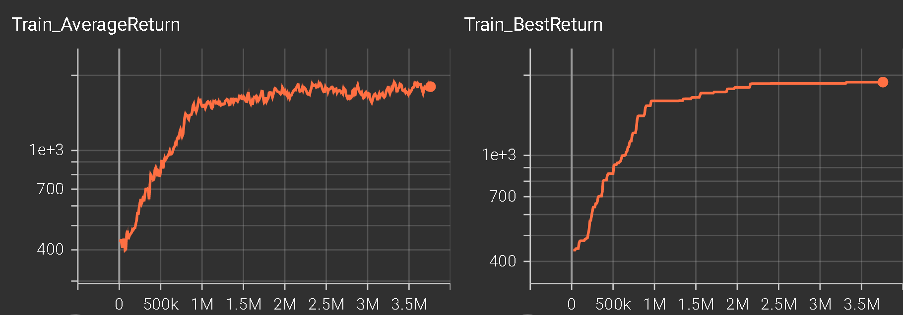
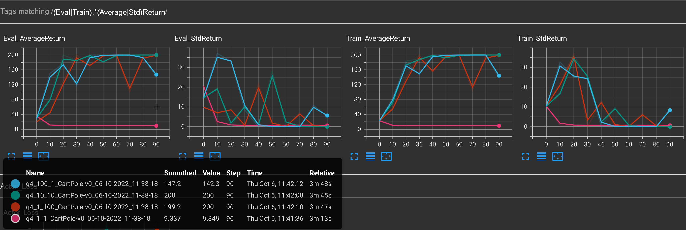

# Experiment log

Meaning of parameters

```python
'--env_name', type=str, default='CartPole-v0'
'--ep_len', type=int, default=200
'--exp_name', type=str, default='todo'
'--n_iter', '-n', type=int, default=200

'--num_agent_train_steps_per_iter', type=int, default=1
'--num_critic_updates_per_agent_update', type=int, default=1
'--num_actor_updates_per_agent_update', type=int, default=1

'--batch_size', '-b', type=int, default=1000 # steps collected per train iteration
'--eval_batch_size', '-eb', type=int, default=400 # steps collected per eval iteration
'--train_batch_size', '-tb', type=int, default=1000 # steps used per gradient step

'--discount', type=float, default=1.0
'--learning_rate', '-lr', type=float, default=5e-3
'--dont_standardize_advantages', '-dsa', action='store_true'
'--num_target_updates', '-ntu', type=int, default=10
'--num_grad_steps_per_target_update', '-ngsptu', type=int, default=10
'--n_layers', '-l', type=int, default=2
'--size', '-s', type=int, default=64

'--seed', type=int, default=1
'--no_gpu', '-ngpu', action='store_true'
'--which_gpu', '-gpu_id', default=0
'--video_log_freq', type=int, default=-1
'--scalar_log_freq', type=int, default=10

'--save_params', action='store_true'
```

Tensorboard commands

* `(Eval|Train).*(Average|Std)Return`

## Part 1: Q learning

The first phase of the assignment is to implement a working version of Q-learning. The default code will run the Ms. Pac-Man game with reasonable hyperparameter settings.

You may want to look inside infrastructure/dqn utils.py to understand how the (memory-optimized) replay buffer works, but you will not need to modify it.

### Question 1: basic Q-learning performance (DQN)

#### LunarLander-v3 (optional)

To accelerate debugging, you may also test on LunarLander-v3.

Our reference solution with the default hyperparameters achieves around 150 reward after 350k timesteps, but there is considerable variation between runs and without the double-Q trick the average return often decreases after reaching 150.


```bash
python cs285/scripts/run_hw3_dqn.py --env_name LunarLander-v3 --exp_name q1
```

||
|:--:|
| <b>Fig 1.1. Learning curves for `LunarLander-v3`.</b>|

Data put in `q1_LunarLander-v3_06-10-2022_12-16-15`.

#### MsPacman-v0

Run it with the default hyperparameters on the Ms. Pac-Man game for 1 million steps using the command below. Our reference solution gets a return of 1500 in this timeframe. On Colab, this will take roughly 3 GPU hours. 


```bash
python cs285/scripts/run_hw3_dqn.py --env_name MsPacman-v0 --exp_name q1
```

Data in `q1_MsPacman-v0_06-10-2022_00-43-20`. Left it running overnight, and it accidentally ran for over 3.7 million steps. 1 million steps took about 2 hours on my laptop. The training curve has two phases: 

* Phase 1: fast learning in the first 1 million steps, reaching 1600 (average training reward).
* Phase 2: slow learning in the next 1.4 million steps, reaching 1850.
* Phase 3: plateau between 1650 and 1850.

||
|:--:|
| <b>Fig 1.2. Learning curves for `MsPacman-v0`.</b>|

Include a learning curve plot showing the performance of your implementation on Ms. Pac-Man. The x-axis should correspond to number of time steps and the y-axis should show the average per-epoch reward as well as the best mean reward so far. Be sure to label the y-axis, since we need to verify that your implementation achieves similar reward as ours.

These quantities are already computed and printed in the starter code. They are also logged to the data folder, and can be visualized using Tensorboard as in previous assignments.

You should not need to modify the default hyperparameters in order to obtain good performance, but if you modify any of the parameters, list them in the caption of the figure.

### Question 2: double Q-learning (DDQN)

Use the double estimator to improve the accuracy of your learned Q values. This amounts to using the online Q network (instead of the target Q network) to select the best action when computing target values. Compare the performance of DDQN to vanilla DQN. Since there is considerable variance between runs, you must run at least three random seeds for both DQN and DDQN. You may use LunarLander-v3 for this question.

```bash
python cs285/scripts/run_hw3_dqn.py --env_name LunarLander-v3 --exp_name q2_dqn_1 --seed 1
python cs285/scripts/run_hw3_dqn.py --env_name LunarLander-v3 --exp_name q2_dqn_2 --seed 2
python cs285/scripts/run_hw3_dqn.py --env_name LunarLander-v3 --exp_name q2_dqn_3 --seed 3
python cs285/scripts/run_hw3_dqn.py --env_name LunarLander-v3 --exp_name q2_doubledqn_1 --double_q --seed 1
python cs285/scripts/run_hw3_dqn.py --env_name LunarLander-v3 --exp_name q2_doubledqn_2 --double_q --seed 2
python cs285/scripts/run_hw3_dqn.py --env_name LunarLander-v3 --exp_name q2_doubledqn_3 --double_q --seed 3
```

||
|:--:|
| <b>Fig 2. Learning curves for `LunarLander-v3`, comparison between the average over 3 runs of DDQN and the average over 3 runs of DQN.</b>|

Data put in

```
q2_dqn_1_LunarLander-v3_15-10-2022_16-43-20
q2_dqn_2_LunarLander-v3_15-10-2022_16-43-20
q2_dqn_3_LunarLander-v3_15-10-2022_16-43-20
q2_doubledqn_1_LunarLander-v3_15-10-2022_16-43-20
q2_doubledqn_2_LunarLander-v3_15-10-2022_16-43-20
q2_doubledqn_3_LunarLander-v3_15-10-2022_16-43-20
```

make a single graph that averages the performance across three runs for both DQN and double DQN. See `scripts/read results.py` for an example of how to read the evaluation returns from Tensorboard logs.

### Question 3: experimenting with hyperparameters

Choose one hyperparameter of your choice and run at least three other settings of this hyperparameter, in addition to the one used in Question 1, and plot all four values on the same graph. Your choice what you experiment with, but you should explain why you chose this hyperparameter in the caption.

We experiment with `--target_update_freq`. The default value is `3000`. We tried `100, 300, 1000, 3000, 10000`. We choose this to modify, because we believe that the target update frequency cannot be too high or too low. Too high (100), and it would approach deep Q-learning without target networks, which is known to be quite unstable, and so we expect the learning curve to become unstable. Too low (10000), and the target would become stale, and we expect the learning curve to stagnate.

Unfortunately, we have no idea how to automate the process except very manually, so we did it by directly modifying the code in `get_env_kwargs`, then modify accordingly.

There are two observations: One, for target update frequency $\leq 1000$, the training collapses. Two, target update frequnecy 10000 results in much slower learning than 3000 but reaching merely the same plateau value.

```bash
python cs285/scripts/run_hw3_dqn.py --env_name LunarLander-v3 --exp_name q3_
```

Data put in

```
q3_100_LunarLander-v3_15-10-2022_19-56-32
q3_300_LunarLander-v3_15-10-2022_19-41-17
q3_1000_LunarLander-v3_15-10-2022_19-43-31
q3_3000_LunarLander-v3_15-10-2022_16-43-20
q3_10000_LunarLander-v3_15-10-2022_19-43-49
```

||
|:--:|
| <b>Fig 3. Learning curves for `LunarLander-v3` for varying target Q-network update frequency in `100, 300, 1000, 3000, 10000`.</b>|

## Part 2: Actor-Critic

### Question 4: Sanity check with Cartpole

Compare the results for the following settings and report which worked best. Do this by plotting all the runs on a single plot and writing your takeaway in the caption.

```bash
python cs285/scripts/run_hw3_actor_critic.py --env_name CartPole-v1 -n 100 -b 1000 --exp_name q4_1_1 -ntu 1 -ngsptu 1
python cs285/scripts/run_hw3_actor_critic.py --env_name CartPole-v1 -n 100 -b 1000 --exp_name q4_100_1 -ntu 100 -ngsptu 1
python cs285/scripts/run_hw3_actor_critic.py --env_name CartPole-v1 -n 100 -b 1000 --exp_name q4_1_100 -ntu 1 -ngsptu 100
python cs285/scripts/run_hw3_actor_critic.py --env_name CartPole-v1 -n 100 -b 1000 --exp_name q4_10_10 -ntu 10 -ngsptu 10
```

||
|:--:|
| <b>Fig 4. Learning curves for `CartPole-v1`.</b>|

At the end, the best setting from above should match the policy gradient results from Cartpole in hw2 (200).

Indeed, in all cases, we have matched the 200 reward. The best one uses `-ntu 10 -ngsptu 10`: it reached 200 reward the fastest, and suffered no catastrophic forgetting.

Data put in

```
q4_1_1_CartPole-v1_06-10-2022_12-04-06
q4_100_1_CartPole-v1_06-10-2022_12-04-06
q4_10_10_CartPole-v1_06-10-2022_12-04-06
q4_1_100_CartPole-v1_06-10-2022_12-04-06
```

### Question 5: Run actor-critic with more difficult tasks

Use the best setting from the previous question to run InvertedPendulum and HalfCheetah:

```python
import shlex, subprocess

ntu = 10 # number of critic network updates
ngsptu = 10 # number of gradient steps per critic network update

commands = []
commands.append("python cs285/scripts/run_hw3_actor_critic.py --env_name InvertedPendulum-v4 --ep_len 1000 --discount 0.95 -n 100 -l 2 -s 64 -b 5000 -lr 0.01 --exp_name q5_{ntu}_{ngsptu} -ntu {ntu} -ngsptu {ngsptu}".format(ntu=ntu, ngsptu=ngsptu))
commands.append("python cs285/scripts/run_hw3_actor_critic.py --env_name HalfCheetah-v4 --ep_len 150 --discount 0.90 --scalar_log_freq 1 -n 150 -l 2 -s 32 -b 30000 -eb 1500 -lr 0.02 --exp_name q5_{ntu}_{ngsptu} -ntu {ntu} -ngsptu {ngsptu}".format(ntu=ntu, ngsptu=ngsptu))

if __name__ == "__main__":
    for command in commands:
        args = shlex.split(command)
        subprocess.Popen(args)
```

Data put in

```
q5_10_10_InvertedPendulum-v4_06-10-2022_11-59-08
q5_10_10_HalfCheetah-v4_15-10-2022_16-53-26
```

Plots with the eval returns for both enviornments:

||
|:--:|
| <b>Fig 5.1. Learning curves for InvertedPendulum-v4.</b>|

||
|:--:|
| <b>Fig 5.2. Learning curves for HalfCheetah-v4.</b>|

Your results should roughly match those of policy gradient. After 150 iterations, your HalfCheetah return should be around 150. After 100 iterations, your InvertedPendulum return should be around 1000.

The returns should start going up immediately. For example, after 20 iterations, your HalfCheetah return should be above -40 and your InvertedPendulum return should near or above 100. However, there is some variance between runs, so the 150-iteration (for HalfCheetah) and 100-iteration (for InvertedPendulum) results are the numbers we use to grade.

## Part 3: Soft Actor-Critic

### Question 6: Run soft actor-critic more difficult tasks

Your deliverables for this section are plots with the eval returns for both enviornments.

Use the best setting from the previous question to run InvertedPendulum and HalfCheetah. You may use InvertedPendulum as a debugging environment, as it is much faster to train.

Here the number of iterations stands for the number of environment steps taken.

```
python cs285/scripts/run_hw3_sac.py --env_name InvertedPendulum-v4 --ep_len 1000 --discount 0.99 --scalar_log_freq 1000 -n 100000 -l 2 -s 256 -b 1000 -eb 2000 -lr 0.0003 --init_temperature 0.1 --exp_name q6a_sac_InvertedPendulum --seed 1
```

After extensive hacking, we found one that passed the autograder.

```
python cs285/scripts/run_hw3_sac.py --env_name InvertedPendulum-v4 --ep_len 1000 --discount 0.99 --scalar_log_freq 1000 -n 100000 -l 2 -s 256 -b 1000 -eb 2000 -lr 3e-5 --init_temperature 0.1 --exp_name q6a_sac_InvertedPendulum_lr3e5 --seed 1
```

Data put in `q6a_sac_InvertedPendulum_lr3e5_InvertedPendulum-v4_17-10-2022_22-47-25`

||
|:--:|
| <b>Fig 6.1. Learning curves for InvertedPendulum-v4.</b>|

```
python cs285/scripts/run_hw3_sac.py --env_name HalfCheetah-v4 --ep_len 150 --discount 0.99 --scalar_log_freq 1500 -n 200000 -l 2 -s 256 -b 1500 -eb 1500 -lr 0.0003 --init_temperature 0.1 --exp_name q6b_sac_HalfCheetah --seed 1
```

What you should see

* Your results should roughly match and exceed those of policy gradient.
* The returns should start going up immediately.
* InvertedPendulum
* After 10k, InvertedPendulum return should be near or above 100.
* After 20k steps, your InvertedPendulum return should reach 1000.
* HalfCheetah
* After 10k steps, your HalfCheetah return should be above -40 (trending toward positive)
* After 50k steps, your HalfCheetah return should be around 200.

Grading criteria

* 1000 eval average return under 100k steps (for InvertedPendulum) 
* 300 average return under 200k steps (for HalfCheetah)

Experiment: using `--actor_update_frequency 10`. This made the actor unable to learn and the actor_loss steadily increased while both `train_return` and `eval_return` failed to improve.

```
python cs285/scripts/run_hw3_sac.py --env_name HalfCheetah-v4 --ep_len 150 --discount 0.99 --scalar_log_freq 1500 -n 200000 -l 2 -s 256 -b 1500 -eb 1500 -lr 0.0003 --init_temperature 0.1 --exp_name q6b_sac_HalfCheetah_auf10 --actor_update_frequency 10 --seed 1
```

Experiment: in computing $J_Q(\theta)$, use the mean action $\bar a_t$ from the actor, rather than sampling an action $a_t$. This made both actor and critic loss to shoot up.

```
python cs285/scripts/run_hw3_sac.py --env_name HalfCheetah-v4 --ep_len 150 --discount 0.99 --scalar_log_freq 1500 -n 200000 -l 2 -s 256 -b 1500 -eb 1500 -lr 0.0003 --init_temperature 0.1 --exp_name q6b_sac_HalfCheetah_mean --seed 1
```

Experiment: whatever this does. `-tb 1500 -lr 3e-5`
```
python cs285/scripts/run_hw3_sac.py --env_name HalfCheetah-v4 --ep_len 150 --discount 0.99 --scalar_log_freq 1500 -n 200000 -l 2 -s 256 -b 1500 -tb 1500 -eb 1500 -lr 3e-5 --init_temperature 0.1 --exp_name q6b_sac_HalfCheetah_lr3e-5_tb1500 --seed 1
```

This one had better performance, but still no 300. Time for more experiments.

Many tears later, I found some hyperparameters that worked alright... and it's 

```
python cs285/scripts/run_hw3_sac.py --env_name HalfCheetah-v4 --ep_len 150 --discount 0.99 --scalar_log_freq 1500 -n 200000 -l 2 -s 256 -b 1500 -eb 1500 -tb 256 -lr 3e-4 --init_temperature 0.1 --seed 1 --exp_name q6b_HalfCheetah_lr3e-4_tb256
```

```
python cs285/scripts/run_hw3_sac.py --env_name HalfCheetah-v4 --ep_len 150 --discount 0.99 --scalar_log_freq 1500 -n 200000 -l 2 -s 256 -b 1500 -eb 1500 -tb 512 -lr 1e-4 --init_temperature 0.1 --seed 1 --exp_name q6b_HalfCheetah_lr1e-4_tb512_l2
```

||
|:--:|
| <b>Fig 6.2. Learning curves for HalfCheetah-v4.</b>|

Fuck everything and try again, without any decoration. Using just the default hyperparameters and nothing more.
```
python cs285/scripts/run_hw3_sac.py --env_name HalfCheetah-v4 --ep_len 150 --discount 0.99 --scalar_log_freq 1500 -n 2000000 -l 2 -s 256 -b 1500 -eb 1500 -lr 0.0003 --init_temperature 0.1 --exp_name q6b_sac_HalfCheetah --seed 1
```

Fuck everything. It's impossible to even replicate what I did before with the exact same command. Fuck it all.!!