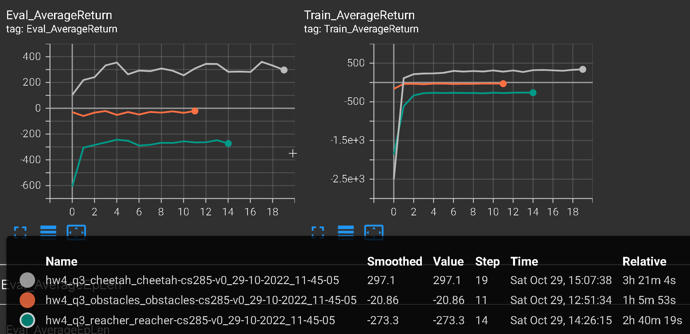
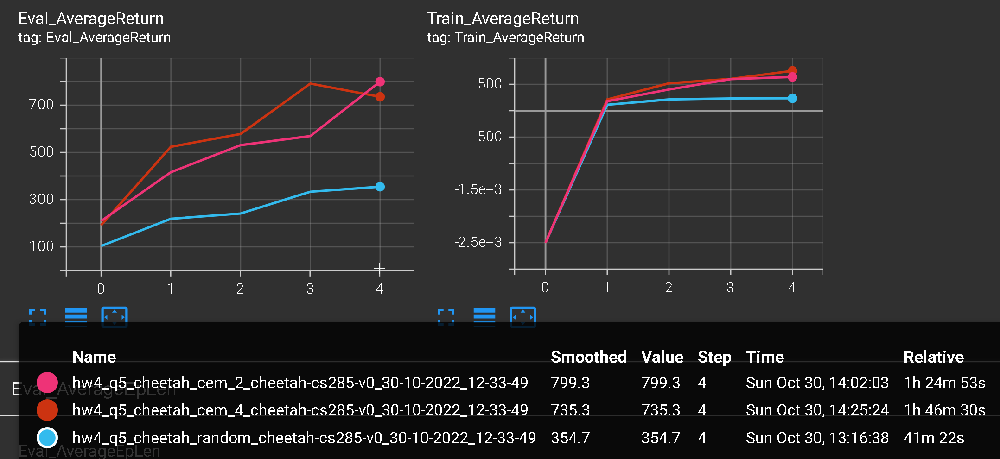

# Experiment log

## Problem 1: supervised training of dynamics model

Goal: train $f_\theta(s_t, a_t) = Normalize(\Delta s_t)$.

Method:

* Real rollouts by random policy.
* $\argmin_\theta MSE(f_\theta(s_t, a_t), Normalize(\Delta s_t))$.
* visualize the resulting predictions.

```
python cs285/scripts/run_hw4_mb.py --exp_name q1_cheetah_n500_arch1x32 --env_name cheetah-cs285-v0 --add_sl_noise --n_iter 1 --batch_size_initial 20000 --num_agent_train_steps_per_iter 500 --n_layers 1 --size 32 --scalar_log_freq -1 --video_log_freq -1 --mpc_action_sampling_strategy 'random'

python cs285/scripts/run_hw4_mb.py --exp_name q1_cheetah_n5_arch2x250 --env_name cheetah-cs285-v0 --add_sl_noise --n_iter 1 --batch_size_initial 20000 --num_agent_train_steps_per_iter 5 --n_layers 2 --size 250 --scalar_log_freq -1 --video_log_freq -1 --mpc_action_sampling_strategy 'random'

python cs285/scripts/run_hw4_mb.py --exp_name q1_cheetah_n500_arch2x250 --env_name cheetah-cs285-v0 --add_sl_noise --n_iter 1 --batch_size_initial 20000 --num_agent_train_steps_per_iter 500 --n_layers 2 --size 250 --scalar_log_freq -1 --video_log_freq -1 --mpc_action_sampling_strategy 'random'
```

Submit the generated plots.

||||
|:--:|
| <b>Fig 1. Qualitative model predictions for each of the three runs above.</b>|

Which model performs the best and why?

## Problem 2: Action selection by learned dynamics model and given reward function

Method:

* collect data with random policy
* train dynamics model $f_\theta$
* evaluate the MPC policy using $f_\theta$

compare `Train AverageReturn` (from random policy) to `Eval AverageReturn` (from MPC policy).

```
python cs285/scripts/run_hw4_mb.py --exp_name q2_obstacles_singleiteration --env_name obstacles-cs285-v0 --add_sl_noise --num_agent_train_steps_per_iter 20 --n_iter 1 --batch_size_initial 5000 --batch_size 1000 --mpc_horizon 10 --video_log_freq -1 --mpc_action_sampling_strategy 'random'
```

Submit this run as part of your run logs, and include a plot of Train AverageReturn and Eval AverageReturn in your pdf. Note that these will just be single dots on the plot, since we ran this for just 1 iteration.

Data put in `hw4_q2_obstacles_singleiteration_obstacles-cs285-v0_29-10-2022_11-32-38`

||
|:--:|
| <b>Fig 2. plot of Train AverageReturn and Eval AverageReturn.</b>|

Expect Train AverageReturn to be around -160 and Eval AverageReturn to be around -70 to -50. Confirmed (actually, my eval return is a bit too good!): `Eval_AverageReturn : -29.98, Train_AverageReturn : -164.5`.

## Problem 3: MBRL algorithm with on-policy data collection and iterative model training

```
python cs285/scripts/run_hw4_mb.py --exp_name q3_obstacles --env_name obstacles-cs285-v0 --add_sl_noise --mpc_horizon 10 --num_agent_train_steps_per_iter 20 --batch_size_initial 5000 --batch_size 1000 --n_iter 12 --video_log_freq -1 --mpc_action_sampling_strategy 'random'

python cs285/scripts/run_hw4_mb.py --exp_name q3_reacher --env_name reacher-cs285-v0 --add_sl_noise --mpc_horizon 10 --num_agent_train_steps_per_iter 1000 --batch_size_initial 5000 --batch_size 5000 --n_iter 15 --video_log_freq -1 --mpc_action_sampling_strategy 'random'

python cs285/scripts/run_hw4_mb.py --exp_name q3_cheetah --env_name cheetah-cs285-v0 --add_sl_noise --mpc_horizon 15 --num_agent_train_steps_per_iter 1500 --batch_size_initial 5000 --batch_size 5000 --n_iter 20 --video_log_freq -1 --mpc_action_sampling_strategy 'random'
```

Expect rewards and time (assuming no GPU):

| environment  | reward        | time (assuming no GPU)  |
|------------- |-------------- |------------------------ |
| obstacles    | -25 to -20    | 40 min                  |
| reacher      | -250 to -300  | 2-3 hr                  |
| cheetah      | 250 to 350    | 3-4 hr                  |

Submit these runs as part of your run logs, and include the performance plots in your pdf.

Data put in `-`

||
|:--:|
| <b>Fig 3. .</b>|

## Problem 4: test MBRL on 3 hyperparameters

compare the performance of your MBRL algorithm as a function of three hyperparameters:

* the number of models in your ensemble,
* the number of random action sequences considered during each action selection,
* the MPC planning horizon.

```
python cs285/scripts/run_hw4_mb.py --exp_name q4_reacher_horizon5 --env_name reacher-cs285-v0 --add_sl_noise --mpc_horizon 5 --num_agent_train_steps_per_iter 1000 --batch_size 800 --n_iter 15 --video_log_freq -1 --mpc_action_sampling_strategy 'random'

python cs285/scripts/run_hw4_mb.py --exp_name q4_reacher_horizon15 --env_name reacher-cs285-v0 --add_sl_noise --mpc_horizon 15 --num_agent_train_steps_per_iter 1000 --batch_size 800 --n_iter 15 --video_log_freq -1 --mpc_action_sampling_strategy 'random'

python cs285/scripts/run_hw4_mb.py --exp_name q4_reacher_horizon30 --env_name reacher-cs285-v0 --add_sl_noise --mpc_horizon 30 --num_agent_train_steps_per_iter 1000 --batch_size 800 --n_iter 15 --video_log_freq -1 --mpc_action_sampling_strategy 'random'


python cs285/scripts/run_hw4_mb.py --exp_name q4_reacher_numseq100 --env_name reacher-cs285-v0 --add_sl_noise --mpc_horizon 10 --num_agent_train_steps_per_iter 1000 --batch_size 800 --n_iter 15 --video_log_freq -1 --mpc_num_action_sequences 100 --mpc_action_sampling_strategy 'random'

python cs285/scripts/run_hw4_mb.py --exp_name q4_reacher_numseq1000 --env_name reacher-cs285-v0 --add_sl_noise --mpc_horizon 10 --num_agent_train_steps_per_iter 1000 --batch_size 800 --n_iter 15 --video_log_freq -1 --mpc_num_action_sequences 1000 --mpc_action_sampling_strategy 'random'


python cs285/scripts/run_hw4_mb.py --exp_name q4_reacher_ensemble1 --env_name reacher-cs285-v0 --ensemble_size 1 --add_sl_noise --mpc_horizon 10 --num_agent_train_steps_per_iter 1000 --batch_size 800 --n_iter 15 --video_log_freq -1 --mpc_action_sampling_strategy 'random'

python cs285/scripts/run_hw4_mb.py --exp_name q4_reacher_ensemble3 --env_name reacher-cs285-v0 --ensemble_size 3 --add_sl_noise --mpc_horizon 10 --num_agent_train_steps_per_iter 1000 --batch_size 800 --n_iter 15 --video_log_freq -1 --mpc_action_sampling_strategy 'random'

python cs285/scripts/run_hw4_mb.py --exp_name q4_reacher_ensemble5 --env_name reacher-cs285-v0 --ensemble_size 5 --add_sl_noise --mpc_horizon 10 --num_agent_train_steps_per_iter 1000 --batch_size 800 --n_iter 15 --video_log_freq -1 --mpc_action_sampling_strategy 'random'
```

1) Submit these runs as part of your run logs.

2) Include the following plots (as well as captions that describe your observed trends) of the following:

* effect of ensemble size
* Effect of the number of candidate action sequences
* efffect of planning horizon

Generate your plots by extracting the corresponding performance numbers from your saved tensorboard eventfiles. Use titles and legends.

Data put in `-`

||
|:--:|
| <b>Fig 4.1. Effect of ensemble size.</b>|

||
|:--:|
| <b>Fig 4.2. Effect of the number of candidate action sequences.</b>|

||
|:--:|
| <b>Fig 4.3. Efffect of planning horizon.</b>|

## Problem 5: Compare MBRL using random-shooting and CEM on the cheetah env

Because CEM can be much slower than random-shooting, we will only run MBRL for 5 iterations for this problem. We will try two hyperparameter settings for CEM and compare their performance to random-shooting.

```
python cs285/scripts/run_hw4_mb.py --exp_name q5_cheetah_random --env_name 'cheetah-cs285-v0' --mpc_horizon 15 --add_sl_noise --num_agent_train_steps_per_iter 1500 --batch_size_initial 5000 --batch_size 5000 --n_iter 5 --video_log_freq -1 --mpc_action_sampling_strategy 'random'

python cs285/scripts/run_hw4_mb.py --exp_name q5_cheetah_cem_2 --env_name 'cheetah-cs285-v0' --mpc_horizon 15 --add_sl_noise --num_agent_train_steps_per_iter 1500 --batch_size_initial 5000 --batch_size 5000 --n_iter 5 --video_log_freq -1 --mpc_action_sampling_strategy 'cem' --cem_iterations 2

python cs285/scripts/run_hw4_mb.py --exp_name q5_cheetah_cem_4 --env_name 'cheetah-cs285-v0' --mpc_horizon 15 --add_sl_noise --num_agent_train_steps_per_iter 1500 --batch_size_initial 5000 --batch_size 5000 --n_iter 5 --video_log_freq -1 --mpc_action_sampling_strategy 'cem' --cem_iterations 4
```

For CEM, expect rewards $\geq 800$, taking 2-3 hours on GPU, and over twice as long without GPU.

What to submit:

1) Submit these runs as part of your run logs.

2) Include a plot comparing random-shooting with CEM, as well as captions that describe how CEM affects results for different numbers of sampling iterations (2 vs. 4).

Be sure to include a title and legend on your plot, and be sure to generate your plot by extracting the corresponding performance numbers from your saved tensorboard eventfiles.

||
|:--:|
| <b>Fig 5. Comparison between random-shooting with CEM. Describe how CEM affects results for different numbers of sampling iterations (2 vs. 4).</b>|

## Problem 6: Dyna with 10-step rollouts and SAC agent

Method: use the learned model to generate additional samples to train a SAC agent.

We will try three settings (each setting corresponds to a command below):

1. Model-free SAC baseline: no additional rollouts from the learned model.
2. Dyna: add single-step rollouts from the model to the replay buffer and incorporate additional gradient steps per real world step.
3. MBPO: add in 10-step rollouts from the model to the replay buffer and incorporate additional gradient steps per real world step.

```
python cs285/scripts/run_hw4_mbpo.py --exp_name q6_cheetah_rlen0 --env_name 'cheetah-cs285-v0' --add_sl_noise --num_agent_train_steps_per_iter 1500 --batch_size_initial 5000 --batch_size 5000 --n_iter 10 --video_log_freq -1 --sac_discount 0.99 --sac_n_layers 2 --sac_size 256 --sac_batch_size 1500 --sac_learning_rate 0.0003 --sac_init_temperature 0.1 --sac_n_iter 1000 --mbpo_rollout_length 0

python cs285/scripts/run_hw4_mbpo.py --exp_name q6_cheetah_rlen1 --env_name 'cheetah-cs285-v0' --add_sl_noise --num_agent_train_steps_per_iter 1500 --batch_size_initial 5000 --batch_size 5000 --n_iter 10 --video_log_freq -1 --sac_discount 0.99 --sac_n_layers 2 --sac_size 256 --sac_batch_size 1500 --sac_learning_rate 0.0003 --sac_init_temperature 0.1 --sac_n_iter 5000 --mbpo_rollout_length 1

python cs285/scripts/run_hw4_mbpo.py --exp_name q6_cheetah_rlen10 --env_name 'cheetah-cs285-v0' --add_sl_noise --num_agent_train_steps_per_iter 1500 --batch_size_initial 5000 --batch_size 5000 --n_iter 10 --video_log_freq -1 --sac_discount 0.99 --sac_n_layers 2 --sac_size 256 --sac_batch_size 1500 --sac_learning_rate 0.0003 --sac_init_temperature 0.1 --sac_n_iter 5000 --mbpo_rollout_length 10
```
