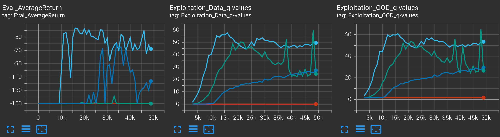

# Experiment log
## Performance tips

Use `--no_gpu` to disable GPU use. This assignment works better with CPU than GPU, due to the lack of parallelization.

The transformed reward function is given by: `r(s, a) = (r(s, a) + shift) × scale`. The choice of shift and scale is up to you, but we used `shift = 1, scale = 100`. Try scaled and shifted rewards for CQL for better performance.

## Why I think this assignment sucks

I think this assignment sucks because it has too many undocumented implementation details that matter just as much as the documented core algorithm. Consequently, the only way to discover implementation details is to code one up myself, find that it just doesn't reproduce what they want me to reproduce, and force the tutors into telling the truth.

My program can learn quite well, but its dependence on hyperparameters is utterly different from their expectations, because I don't know the undocumented implementation details.

I can pass the autograders perfectly. But I can't honestly write the report the way they expect. I can see what they want the hyperparameter analyses to be like, and I can't write it like that at all because that's not the data I get.

They expect for example scale-and-shift to improve CQL, but I got no effect. They expect the performance to be consistent, but I got 1 out of 5 runs working. They expect lambda to have a unimodal effect on learning, but I got completely random effects. There is no way to write the write the report. I think their conclusions are bullshit, and they only got their conclusions because they used specific implementation details that created their conclusions.

When people write papers in DRL, they usually start by an algorithm that worked, then they tinker with it with a new idea, until the new program works better. Then they run some ablation studies, and write up the paper, using the ablation studies to "explain" what the hyperparameters do. Since they cannot put the entire program into the paper, they had to abstract the program into "core algorithm", "implementation details", "hyperparameters". The idea is that if people implement the "core algorithm" correctly, then the performance would be roughly the same. Further, the implementation details should be orthogonal to the hyperparameters. For example, if I use RND with L2-norm-squared loss, then the AWAC agent performance should depend on lambda in some unimodal way (going up, then going down). If I use RND with L2-norm loss, then the AWAC agent performance should *still* depend on lambda in the same unimodal way, except shifted.

This is not at all what I observed. My implementation follows the exact core algorithms given in the homework sheet, except that it does not follow the implementation details. The result is utterly non-interpretable, random dependence on lambda in the AWAC agent. This at once throws the official interpretation of $\lambda$ in AWAC into doubt. Does $\lambda$ really do what they say it does, or is it merely a confabulation they made up, just because their implementation details allowed them to confabulate something that sounds reasonable?

In other words, do they really understand what $\lambda$ does in AWAC, or did they simply fabricate and confabulate? Did they start with what they wanted to observe, and iterate over implementation details until they fished out what they wanted from the vast combinatorial ocean of network architectures?

What I think is happening is that we have a serious case of confabulation. Suppose I have a PPO algorithm and it has 37 [implementation details](https://iclr-blog-track.github.io/2022/03/25/ppo-implementation-details/), and I go and try turning on and off these implementation details one by one. I get a big list. What am I supposed to do about it? Explain them? But it's only going to be a confabulation. We have no idea what is important and what is not in RL. I don't know, and I think the professors don't know either. If they do, they would have added in the implementation details that actually mattered!

## Part 1: Pure exploration by RND

### Algorithm

* Initialize RND network
* ArgmaxPolicy on reward (generated by exploration critic), for `num_exploration_steps` iterations
* online exploitation

### Eval

The state density plots at the end of exploration phase are more diagnostic than the state density plots at the end of exploitation, because during exploitation, the exploitation agent (DQN with epsilon-greedy exploration), would learn to reach the goal with high probability, and consequently the state density plots all converge to a roughly equal state coverage of the shortest path to the goal.

Their state density plots at the end of exploration phase show that the RND exploration is significantely further-along at exploration. The state density plots at the end of exploitation phase show that after a long period of exploitation (40k steps), the two DQN, trained by data obtained by RND and Random exploration strategies, converge to the same optimal strategy. This can be explained by saying that after 40k steps, the DQN itself would have converged anyway, and the difference in initialization by RND or Random is converged into nothing.

||Random, end of exploration|end of exploitation|RND, end of exploration|end of exploitation|
|--|--|--|--|--|
|Easy|||||
|Medium|||||

The expectation is that on `PointmassEasy-v0`, the agent should reach 100-episode mean-reward `-25`, within `num_exploration_steps + 4000 = 14k` iters. The actually achieved results are as follows. We see that for the `Easy` environment, the RND has a 7k lead on Random, but for the `Medium` environment, there is no difference. We think this is because for the `Easy` exploration, the RND agent has already reached the goal enough times during the exploration phase, allowing the exploitation agent to start exploiting right away. However, for the `Medium` environment, both RND and Random failed to reach the goal enough times during exploration phase, and consequently both of them are essentially doing the epsilon-greedy DQN learning when the exploitation phase starts, and so they reach the goal at roughly the same time.

||The learning curves of RND and random exploration on `Easy` and `Medium`|
|--|--|
|Easy||
|Medium||

Commands used:

```
python cs285/scripts/run_hw5_expl.py --no_gpu --num_timesteps 10000 --env_name PointmassEasy-v0 --use_rnd --unsupervised_exploration --exp_name q1_env1_rnd
python cs285/scripts/run_hw5_expl.py --no_gpu --num_timesteps 10000 --env_name PointmassEasy-v0           --unsupervised_exploration --exp_name q1_env1_random
python cs285/scripts/run_hw5_expl.py --no_gpu --num_timesteps 10000 --env_name PointmassMedium-v0 --use_rnd --unsupervised_exploration --exp_name q1_env2_rnd
python cs285/scripts/run_hw5_expl.py --no_gpu --num_timesteps 10000 --env_name PointmassMedium-v0           --unsupervised_exploration --exp_name q1_env2_random
```

Data put into:

```
hw5_expl_q1_env2_rnd_PointmassMedium-v0_13-11-2022_00-10-18
hw5_expl_q1_env1_random_PointmassEasy-v0_13-11-2022_00-10-18
hw5_expl_q1_env1_rnd_PointmassEasy-v0_13-11-2022_00-10-18
hw5_expl_q1_env2_random_PointmassMedium-v0_13-11-2022_00-10-18
```

### Extra experiments

I tried different kinds of initialization for RND. The results are as follows:

|        | $\hat f$ gaussian; $f$ uniform | $\hat f$ uniform; $f$ gaussian  |
|--------|--------------------------------|---------------------------------|
| Easy   | RND > Random by 7k steps       | RND > Random by 4k steps        |
| Medium | Random > RND by 3k steps       | Random > RND by up to 20k steps |

Based on the above data, we used $\hat f$ gaussian; $f$ uniform initialization for all future experiments.

The performance of RND depends strongly on random seed. I tried 6 random seeds, and obtained the following results on Medium environment.

* the best RND run manages to outrun Random by 7k steps;
* the median run lags Random by about 3k steps;
* the worst one lags Random by 14k steps.

||
|:--:|
| <b>Fig 1.3 The effect of different random seeds on using RND on `PointmassMedium-v0`.</b>|

## Part 1': Pure exploration by another algorithm

Since we are using just gridworld, we don't have to do anything fancy. I used a direct count-based method. It has $r_{explore, t} := N_t(s_t)^{-1/2}$, where $N_t(s_t)$ is the number of counts that state $s_t$ has been observed so far.

We ran the exploration algorithm on the `VeryHard` environment for the maximal challenge. We see that after 50k exploration steps, the agent has explored over 90% of the way towards the goal.

|20k exploration steps|30k exploration steps|50k exploration steps|
|--|--|--|
||||

In comparison, the RND agent barely left the starting point.


We think the reason for the vastly increased exploration efficiency of the count-based method is that it is designed specifically for gridworlds, while the RND method is generic. As usual, the more inductive bias we build into the model, the faster it learns.

## Part 2.1: Offline learning (CQL) on exploration data

### Evaluate it and compare it to a standard DQN critic

Data collection is disabled after exploitation begins. This can be verified by the `replay buffer size` in the Tensorboard logging files:


We ran DQN and CQL, on `PointmassMedium-v0`, at the default value of `num_exploration_steps = 10000`. DQN is $\alpha_{CQL} = 0$, and CQL is $\alpha_{CQL} = 0.1$. Each is repeated on 5 different random seeds.


The learning curves and Q-value curves are as follows:

| | DQN | CQL |
|--|--|--|
|no shift-and-scale|| |
|shift-and-scale| | |

Examine the difference between the Q-values on state-action tuples in the dataset learned by CQL vs DQN. Does CQL give rise to Q-values that underestimate the Q-values learned via a standard DQN? Why?

In theory, the OOD Q-values should be overestimated for DQN, but much less so for CQL. The Q-values should be underestimated by CQL than DQN, since the CQL loss is minimized by pushing down on Q-values everywhere OOD.

In practice, the OOD Q-values really are higher than the in-distribution Q-values, by about 5. However, there is no statistically significant difference between the Q-values learned by CQL and DQN. **We refuse to confabulate a reason for this, due to suspicion detailed in the beginning.** Note that only 1 out of 5 runs were stable, and some of the runs have quadratic blow-up, clearly going completely unstable. This happened despite using the given hyperparameters. We believe it is due to our using a different set of "implementation details", ruining the illusion of interpretability.

Try the next experiment, then reason about a common cause behind both of these phenomena.

On `PointmassMedium-v0` test the performance of CQL with reward transform `shift = 1, scale = 100`. Is it better or worse? What do you think is the reason behind this difference in performance, if any?

In theory, using shifting and scaling brings the shape of external rewards to the same scale as the exploration rewards. The exploration rewards from RND are normalized to be about +1 per step, and so over the entire episode, it sums up to about 100. Now, using the `shift=1, scale=100` makes the external reward to also have episodic size about 100, thus roughly the same learning rates can be used for both exploration and exploitation phases.

**There is no common cause. There is no interpretable pattern whatsoever. I refuse to confabulate.**

## Part 2.2 amount of exploration data

Vary the amount of exploration data for atleast two values of the variable `num_exploration_steps` in the offline setting and report a table of performance of DQN and CQL as a function of this amount.

```python
command_stem = [
"python cs285/scripts/run_hw5_expl.py --no_gpu --env_name {env} --use_rnd --num_exploration_steps={nes} --offline_exploitation --cql_alpha=0.1 --unsupervised_exploration --exp_name q2_cql_numsteps_{nes}",
"python cs285/scripts/run_hw5_expl.py --no_gpu --env_name {env} --use_rnd --num_exploration_steps={nes}] --offline_exploitation --cql_alpha=0.0 --unsupervised_exploration --exp_name q2_dqn_numsteps_{nes}",
]

env = "PointmassMedium-v0" # or PointmassHard-v0
for s in command_stem:
    for nes in [5000, 15000]:
        commands.append(s.format(env=env, nes=nes))
```

The plots are as shown. We see that CQL tends to be more unstable (I know this is not what is expected from me, but I refuse to confabulate), and longer exploration phase also leads to more stable training.

| | DQN | CQL |
|--|--|--|
|num_exploration_steps=5k|| |
|15k| | |

## Part 2.3: $\alpha_{CQL}$

Use `PointmassMedium-v0`.

Try two informative values of $\alpha_{CQL}$, in addition to $0.0, 0.1$.

```
python cs285/scripts/run_hw5_expl.py --no_gpu --env_name PointmassMedium-v0 --use_rnd --unsupervised_exploration --offline_exploitation --cql_alpha=[0.02, 0.5] --exp_name q2_alpha[cql_alpha]
```
|$\alpha$| learning curves |
|--|--|
|$0$||
|$0.02$||
|$0.1$||
|$0.5$||

* Interpret your results for each part.

It seems that the higher alpha is, the more unstable it gets.

* Why or why not do you expect one algorithm to be better than the other?

Theoretically, I expect the higher alpha values to lead to more stable, but slower learning. That is, the learning curves would go up later, but with less variation.

* Do the results align with this expectation? Why?

This is completely opposite to what I expected theoretically. I refuse to confabulate. I simply do not know, and I bet you don't either!

## Part 3: Supervised exploration with mixed reward bonuses

Previous explorations used only exploration reward, not environment reward. This is "unsupervised" exploration.

RND variant exploration that will not utilize the exploration reward and the environment reward separately (as you did in Part 1) but will use a combination of both rewards for exploration as compared to performing fully “supervised” exploration via the RND critic and then finetune the resulting exploitation policy in the environment.

Modify `exploration_critic` to use: `r_mixed = w_explore × r_{RND explore} + w_exploit × r_env`.

### Eval

Evaluate on `PointmassMedium-v0`, `PointmassHard-v0`. Compare with exploitation critic, trained only on `r_env`.

```
python cs285/scripts/run_hw5_expl.py --no_gpu --env_name PointmassMedium-v0 --use_rnd --num_exploration_steps=20000 --cql_alpha=0.0 --exp_name q3_medium_dqn
python cs285/scripts/run_hw5_expl.py --no_gpu --env_name PointmassMedium-v0 --use_rnd --num_exploration_steps=20000 --cql_alpha=1.0 --exp_name q3_medium_cql
python cs285/scripts/run_hw5_expl.py --no_gpu --env_name PointmassHard-v0 --use_rnd --num_exploration_steps=20000 --cql_alpha=0.0 --exp_name q3_hard_dqn
python cs285/scripts/run_hw5_expl.py --no_gpu --env_name PointmassHard-v0 --use_rnd --num_exploration_steps=20000 --cql_alpha=1.0 --exp_name q3_hard_cql
```

* compare with Part 2.2 for a given number of `num_exploration_steps`.

Supervised exploration works much worse than pure exploration, both for CQL and DQN.

* plot learning curves


* how do the results compare to Part 1, for the default value of `num_exploration_steps`?

Supervised exploration with CQL or DQN works much worse than pure exploration with DQN.

* How effective is (supervised) exploration with a combination of both rewards as compared to purely RND based (unsupervised) exploration and why?

Supervised exploration works much worse than pure exploration. I don't know why, and **neither do you**. I refuse to confabulate, unlike you.


## Part 4: Offline Learning with AWAC

Change `agents/awac_agent.py` and `policies/MLP_policy.py`.

### Eval

Gridsearch:

* unsupervised and supervised exploration with RND.
* tune the λ value in the AWAC update, which controls the conservatism of the algorithm.

```python
command_stem = [
"python cs285/scripts/run_hw5_awac.py --no_gpu --env_name PointmassEasy-v0   --use_rnd --num_exploration_steps=20000 --unsupervised_exploration --awac_lambda={l} --exp_name q4_awac_easy_unsupervised_lam{l}",
"python cs285/scripts/run_hw5_awac.py --no_gpu --env_name PointmassMedium-v0 --use_rnd --num_exploration_steps=20000 --unsupervised_exploration --awac_lambda={l} --exp_name q4_awac_medium_unsupervised_lam{l}",
"python cs285/scripts/run_hw5_awac.py --no_gpu --env_name PointmassEasy-v0   --use_rnd --num_exploration_steps=20000                            --awac_lambda={l} --exp_name q4_awac_easy_supervised_lam{l}",
"python cs285/scripts/run_hw5_awac.py --no_gpu --env_name PointmassMedium-v0 --use_rnd --num_exploration_steps=20000                            --awac_lambda={l} --exp_name q4_awac_medium_supervised_lam{l}",
]

awac_l = [0.1,1,2,10,20,50]
```

* submit learning curves for each of these tasks
* explain what λ signifies and how the performance compares to BC and DQN given different λ values.
* consider λ values outside of the range suggested above
* consider how it may affect performance both empirically and theoretically.

Observations:

The learning curves successfully passed the autograder by a comfortable margin.

|                 	| expectation 	| result 	|
|-----------------	|-------------	|--------	|
| PointmassEasy   	| > -30       	|  -19 	    |
| PointmassMedium 	| > -60       	|  -35	    |

* For both environments, the learning curves for supervised learning are higher than unsupervised learning.
* The best lambda is actually pretty complicated, with nonlinear dependence:

| best lambda | unsupervised | supervised |
|-------------|------------|--------------|
| Easy        | 2        | 20           |
| Medium      | 50         | 20          |

For the Easy environments, the learning curves plateau too fast and too consistently, so we zoom into the first 10k steps before screenshotting the learning curves.


||Unsupervised|Supervised|
|--|--|--|
|Easy|||
|Medium|||

Theoretical explanation: $\lambda$ is the "temperature" of the advantage-weighting. At high $\lambda$, it effectively doesn't care about advantage, meaning that it gives roughly equal weighting to all -- and we end up with uniform random strategy. At low $\lambda$, it becomes more greedy. At $\lambda \to 0$ limit, we obtain the perfectly maximizing strategy (assuming we have perfect data coverage and perfect convergence).

However, in practice, the learning curves have no clear relationship with $\lambda$. It is not the case that the learning curves are monotonically improving, or degrading, or unimodal. I see no simple relationship between the learning curves and $\lambda$ whatsoever.

## Part 5: Offline Learning with IQL

The changes here primarily need to be added to `agents/iql_agent.py`
and `critics/iql_critic.py`, and will build on your implementation of AWAC from Part 4.

### Eval

```python
command_stem = [
"python cs285/scripts/run_hw5_iql.py --no_gpu --env_name PointmassEasy-v0   --exp_name q5_easy_supervised_lam{l}_tau{t}                                    --use_rnd --num_exploration_steps=20000 --awac_lambda={l} --iql_expectile={t}",
"python cs285/scripts/run_hw5_iql.py --no_gpu --env_name PointmassMedium-v0 --exp_name q5_iql_medium_supervised_lam{l}_tau{t}                              --use_rnd --num_exploration_steps=20000 --awac_lambda={l} --iql_expectile={t}",
"python cs285/scripts/run_hw5_iql.py --no_gpu --env_name PointmassEasy-v0   --exp_name q5_easy_unsupervised_lam{l}_tau{t}       --unsupervised_exploration --use_rnd --num_exploration_steps=20000 --awac_lambda={l} --iql_expectile={t}",
"python cs285/scripts/run_hw5_iql.py --no_gpu --env_name PointmassMedium-v0 --exp_name q5_iql_medium_unsupervised_lam{l}_tau{t} --unsupervised_exploration --use_rnd --num_exploration_steps=20000 --awac_lambda={l} --iql_expectile={t}",
]

iql_tau = [0.5, 0.6, 0.7, 0.8, 0.9, 0.95, 0.99]
# Best lambda for AWAC, found in part 4.
awac_l = ...
```

* Explain what τ signifies.

$\tau$ is expectile. The higher $\tau$ go towards 1, the more the learned Q-value is maximizing. The closer $\tau$ is to 0.5, the more the learned Q-value is simply estimating $Q^{\pi_\beta}$, the Q-value of the policy used to generate the dataset. 

With $\tau = 0.5$, we get behavior cloning. With $\tau= 1$, we get SARSA.

* Explain how the τ values in the range suggested above affected performance both empirically and theoretically.

Theoretically, with higher $\tau$, the Q-value would be more maximizing, but more unstable, so we expect a unimodal performance: at $\tau=0.5$, the agent learns slowly but stably, and as it goes higher, the agent learns faster but more unstably. At an intermediate value, the agent learns the best.

Empirically, supervised seem slightly more stable, and the intermediate values of $\tau$ are the best, which matches the theoretical expectation.

For the `Easy` runs, the difference is too small to be visible, but for the `Medium` runs, we see significant differences, where it seems $\tau = 0.6$ to $0.7$ is the best.

|best $\tau$| unsupervised | supervised |
|--|--|--|
| Easy | ? | ? |
| Medium | 0.7 | 0.6 |

| | unsupervised | supervised |
|--|--|--|
| Easy |  | |
| Medium |  | |

* Compare CQL, IQL and AWAC

All methods reached the plateau performance in `Medium`, but CQL is very unstable, while AWAC and IQL are stable. IQL, when tuned correctly, learns faster than AWAC.