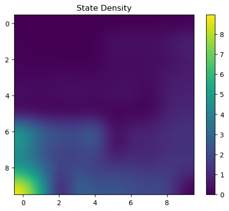

# Experiment log

Exploration: RND, Boltzman

Offline RL: CQL, AWAC, IQL

## Performance tips

The transformed reward function is given by: `r(s, a) = (r(s, a) + shift) × scale`. The choice of shift and scale is up to you, but we used `shift = 1, scale = 100`.

Try scaled and shifted rewards for CQL for better performance.

## Part 1: Pure exploration by RND

* Initialize RND network
* ArgmaxPolicy on reward (generated by exploration critic), for `num_exploration_steps` iterations
* online exploitation

### Eval

`PointmassEasy-v0`, 100 episodes mean reward `-25`, within `num_exploration_steps + 4000` iters.

$(s_t, a_t)$ density on this easy environment is more uniformly spread over the reachable parts of the environment (that are not occupied by walls) with RND as compared to random exploration where most of the density would be concentrated around the $(s_0)$.

* state density heatmaps: `rl_trainer.py` with `dump_density_graphs`; `logger` with `log_figures`. See directory `experiment log`.
* compare RND exploration to random (epsilon-greedy) exploration.
* Filelist:
1. all state density plots
2. a comparative evaluation of the learning curves obtained via RND and random exploration in your report.

| <b>Fig 1.1 State density plots of RND and random exploration.</b>|

||Random|RND|
|--|--|--|
|Easy|||
|Medium|||


||
|:--:|
| <b>Fig 1.2 The learning curves of RND and random exploration.</b>|

The possible environments are: `PointmassEasy-v0`, `PointmassMedium-v0`, `PointmassHard-v0`.

```
python cs285/scripts/run_hw5_expl.py --no_gpu --num_timesteps 10000 --env_name PointmassEasy-v0 --use_rnd --unsupervised_exploration --exp_name q1_env1_rnd
python cs285/scripts/run_hw5_expl.py --no_gpu --num_timesteps 10000 --env_name PointmassEasy-v0           --unsupervised_exploration --exp_name q1_env1_random
python cs285/scripts/run_hw5_expl.py --no_gpu --num_timesteps 10000 --env_name PointmassMedium-v0 --use_rnd --unsupervised_exploration --exp_name q1_env2_rnd
python cs285/scripts/run_hw5_expl.py --no_gpu --num_timesteps 10000 --env_name PointmassMedium-v0           --unsupervised_exploration --exp_name q1_env2_random
```

Data put into

```
hw5_expl_q1_env1_rnd_PointmassEasy-v0_11-11-2022_14-10-43
hw5_expl_q1_env2_random_PointmassMedium-v0_11-11-2022_14-10-43
hw5_expl_q1_env2_rnd_PointmassMedium-v0_11-11-2022_14-10-43
hw5_expl_q1_env1_random_PointmassEasy-v0_11-11-2022_14-10-43
```

## Part 1': Pure exploration by another algorithm

Ideas:

* count-based exploration methods (such as pseudocounts and Exploration with Exemplar Models)
* prediction error based approaches (such as exploring states with high TD error)
* approaches that maximize marginal state entropy

Compare to RND, explain the trends. The heatmaps and trajectory visualizations will likely be helpful in understanding the behavior here.

```
python cs285/scripts/run_hw5_expl.py --no_gpu --env_name PointmassMedium-v0 --unsupervised_exploration <add arguments for your method> --exp_name q1_alg_med
python cs285/scripts/run_hw5_expl.py --no_gpu --env_name PointmassHard-v0 --unsupervised_exploration <add arguments for your method> --exp_name q1_alg_hard
```

## Part 2.1: Offline learning on exploration data

* offline RL on RND dataset
* compare resulting policy is to the optimal policy.

[ ] Implement the conservative Q-learning algorithm in this question which primarily needs to be added in critic/cql_critic.py and you need to use the CQL critic as the extrinsic critic in `agents/explore_or_exploit_agent.py`.

### Evaluate it and compare it to a standard DQN critic

[ ] Write down the logic for disabling data collection in `agents/explore_or_exploit_agent.py` after exploitation begins and only evaluate the performance of the extrinsic critic after training on the data collected by the RND critic.

[ ] run DQN and CQL, on `PointmassMedium-v0`, at the default value of `num_exploration_steps = 10000`. DQN is $\alpha_{CQL} = 0$, and CQL is $\alpha_{CQL} = 0.1$.

```
python cs285/scripts/run_hw5_expl.py --no_gpu --env_name PointmassMedium-v0 --exp_name q2_dqn --use_rnd --unsupervised_exploration --offline_exploitation --cql_alpha=0
python cs285/scripts/run_hw5_expl.py --no_gpu --env_name PointmassMedium-v0 --exp_name q2_cql --use_rnd --unsupervised_exploration --offline_exploitation --cql_alpha=0.1
```

Examine the difference between the Q-values on state-action tuples in the dataset learned by CQL vs DQN.

Does CQL give rise to Q-values that underestimate the Q-values learned via a standard DQN? Why?

Try the next experiment, then reason about a common cause behind both of these phenomena.

### Evaluate transformed reward function for training the exploitation critic

On `Pointmass??-v0` (your choice) test the performance of CQL with reward transform `shift = 1, scale = 100`. Is it better or worse? What do you think is the reason behind this difference in performance, if any?

Examine the performance of CQL when utilizing a transformed reward function for training the exploitation critic. Do not change any code in the environment class, instead make this change in `agents/explore_or_exploit_agent.py`.

The transformed reward function is given by: `r(s, a) = (r(s, a) + shift) × scale`. The choice of shift and scale is up to you, but we used `shift = 1, scale = 100`.

## Part 2.2 amount of exploration data

vary the amount of exploration data for atleast two values of the variable `num_exploration_steps` in the offline setting and report a table of performance of DQN and CQL as a function of this amount.

You need to do it on the medium or hard environment. 

```python
command_stem = [
"python cs285/scripts/run_hw5_expl.py --no_gpu --env_name {env} --use_rnd --num_exploration_steps={nes} --offline_exploitation --cql_alpha=0.1 --unsupervised_exploration --exp_name q2_cql_numsteps_{nes}",
"python cs285/scripts/run_hw5_expl.py --no_gpu --env_name {env} --use_rnd --num_exploration_steps={nes}] --offline_exploitation --cql_alpha=0.0 --unsupervised_exploration --exp_name q2_dqn_numsteps_{nes}",
]

env = "PointmassMedium-v0" # or PointmassHard-v0
for s in command_stem:
    for nes in [5000, 15000]:
        commands.append(s.format(env=env, nes=nes))
```

## Part 2.3: $\alpha_{CQL}$

Use `PointmassMedium-v0`.

Try two informative values of $\alpha_{CQL}$, in addition to $0.0, 0.1$.

Report the results for these values

compare it to CQL with the previous α and DQN

(optional) scaled and shifted rewards for CQL

```
python cs285/scripts/run_hw5_expl.py --no_gpu --env_name PointmassMedium-v0 --use_rnd --unsupervised_exploration --offline_exploitation --cql_alpha=[0.02, 0.5] --exp_name q2_alpha[cql_alpha]
```

* Interpret your results for each part.
* Why or why not do you expect one algorithm to be better than the other?
* Do the results align with this expectation? Why?

## Part 3: Supervised exploration with mixed reward bonuses

Previous explorations used only exploration reward, not environment reward. This is "unsupervised" exploration.

RND variant exploration that will not utilize the exploration reward and the environment reward separately (as you did in Part 1) but will use a combination of both rewards for exploration as compared to performing fully “supervised” exploration via the RND critic and then finetune the resulting exploitation policy in the environment.

[ ] modify `exploration_critic` to use: `r_mixed = w_explore × r_{RND explore} + w_exploit × r_env`

The weighting is controlled in `agents/explore_or_exploit_agent.py`.

### Eval

Evaluate on `PointmassMedium-v0`, `PointmassHard-v0`. Compare with exploitation critic, trained only on `r_env`.

(optional) scaled and shifted rewards for CQL

For the hard environment, with a reward transformation of `scale = 100` and `shift = 1`, you should find that CQL is better than DQN.

```
python cs285/scripts/run_hw5_expl.py --no_gpu --env_name PointmassMedium-v0 --use_rnd --num_exploration_steps=20000 --cql_alpha=0.0 --exp_name q3_medium_dqn
python cs285/scripts/run_hw5_expl.py --no_gpu --env_name PointmassMedium-v0 --use_rnd --num_exploration_steps=20000 --cql_alpha=1.0 --exp_name q3_medium_cql
python cs285/scripts/run_hw5_expl.py --no_gpu --env_name PointmassHard-v0 --use_rnd --num_exploration_steps=20000 --cql_alpha=0.0 --exp_name q3_hard_dqn
python cs285/scripts/run_hw5_expl.py --no_gpu --env_name PointmassHard-v0 --use_rnd --num_exploration_steps=20000 --cql_alpha=1.0 --exp_name q3_hard_cql
```

* compare with Part 2.2 for a given number of `num_exploration_steps`.
* plot learning curves
* how do the results compare to Part 1, for the default value of `num_exploration_steps`?
* How effective is (supervised) exploration with a combination of both rewards as compared to purely RND based (unsupervised) exploration and why?


||
|:--:|
| <b>Fig 3. Learning curves for both DQN and CQL-based exploitation critics on `PointmassMedium-v0`, `PointmassHard-v0`.</b>|

## Part 4: Offline Learning with AWAC

Change `agents/awac_agent.py` and `policies/MLP_policy.py`.

### Eval

Gridsearch:

* unsupervised and supervised exploration with RND.
* tune the λ value in the AWAC update, which controls the conservatism of the algorithm.

|                 	| expectation 	| result 	|
|-----------------	|-------------	|--------	|
| PointmassEasy   	| > -30       	|        	|
| PointmassMedium 	| > -60       	|        	|

```python
command_stem = [
"python cs285/scripts/run_hw5_awac.py --no_gpu --env_name PointmassEasy-v0   --use_rnd --num_exploration_steps=20000 --unsupervised_exploration --awac_lambda={l} --exp_name q4_awac_easy_unsupervised_lam{l}",
"python cs285/scripts/run_hw5_awac.py --no_gpu --env_name PointmassMedium-v0 --use_rnd --num_exploration_steps=20000 --unsupervised_exploration --awac_lambda={l} --exp_name q4_awac_medium_unsupervised_lam{l}",
"python cs285/scripts/run_hw5_awac.py --no_gpu --env_name PointmassEasy-v0   --use_rnd --num_exploration_steps=20000                            --awac_lambda={l} --exp_name q4_awac_easy_supervised_lam{l}",
"python cs285/scripts/run_hw5_awac.py --no_gpu --env_name PointmassMedium-v0 --use_rnd --num_exploration_steps=20000                            --awac_lambda={l} --exp_name q4_awac_medium_supervised_lam{l}",
]

awac_l = [0.1,1,2,10,20,50]
```

* submit learning curves for each of these tasks
* explain what λ signifies and how the performance compares to BC and DQN given different λ values.
* consider λ values outside of the range suggested above
* consider how it may affect performance both empirically and theoretically.

## Part 5: Offline Learning with IQL

The changes here primarily need to be added to `agents/iql_agent.py`
and `critics/iql_critic.py`, and will build on your implementation of AWAC from Part 4.


### Eval

|                 	| expectation 	| result 	|
|-----------------	|-------------	|--------	|
| PointmassEasy   	| > -30       	|        	|
| PointmassMedium 	| > -50       	|        	|

```python
command_stem = [
"python cs285/scripts/run_hw5_iql.py --no_gpu --env_name PointmassEasy-v0   --exp_name q5_easy_supervised_lam{l}_tau{t}                                    --use_rnd --num_exploration_steps=20000 --awac_lambda={l} --iql_expectile={t}",
"python cs285/scripts/run_hw5_iql.py --no_gpu --env_name PointmassMedium-v0 --exp_name q5_iql_medium_supervised_lam{l}_tau{t}                              --use_rnd --num_exploration_steps=20000 --awac_lambda={l} --iql_expectile={t}",
"python cs285/scripts/run_hw5_iql.py --no_gpu --env_name PointmassEasy-v0   --exp_name q5_easy_unsupervised_lam{l}_tau{t}       --unsupervised_exploration --use_rnd --num_exploration_steps=20000 --awac_lambda={l} --iql_expectile={t}",
"python cs285/scripts/run_hw5_iql.py --no_gpu --env_name PointmassMedium-v0 --exp_name q5_iql_medium_unsupervised_lam{l}_tau{t} --unsupervised_exploration --use_rnd --num_exploration_steps=20000 --awac_lambda={l} --iql_expectile={t}",
]

iql_tau = [0.5, 0.6, 0.7, 0.8, 0.9, 0.95, 0.99]
# Best lambda for AWAC, found in part 4.
awac_l = ? 
```

Explain what τ signifies.

Explain how the τ values in the range suggested above affected performance both empirically and theoretically.

Explain how the performance compares to BC and SARSA given different τ values.

[ ] Run unsupervised and supervised exploration with RND.

Compare CQL, IQL and AWAC

### Submission

learning curves for each of these tasks