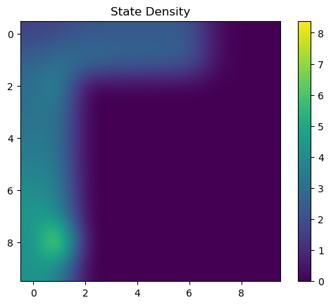

# Experiment log
## Performance tips

Use `--no_gpu` to disable GPU use. This assignment works better with CPU than GPU, due to the lack of parallelization.

The transformed reward function is given by: `r(s, a) = (r(s, a) + shift) × scale`. The choice of shift and scale is up to you, but we used `shift = 1, scale = 100`. Try scaled and shifted rewards for CQL for better performance.

## Part 1: Pure exploration by RND

### Algorithm

* Initialize RND network
* ArgmaxPolicy on reward (generated by exploration critic), for `num_exploration_steps` iterations
* online exploitation

### Eval

The state density plots at the end of exploration phase are more diagnostic than the state density plots at the end of exploitation, because during exploitation, the exploitation agent (DQN with epsilon-greedy exploration), would learn to reach the goal with high probability, and consequently the state density plots all converge to a roughly equal state coverage of the shortest path to the goal.

We compare the state density plot at the end of exploration phase. We see that at the end of exploration phase, the RND exploration is significantely further-along at exploration.

||Random|RND|
|--|--|--|
|Easy|||
|Medium|||

The state density plot at the end of exploitation phase shows that after a long period of exploitation (40k steps), the two DQN, trained by data obtained by RND and Random exploration strategies, converge to the same optimal strategy. This can be explained by saying that after 40k steps, the DQN itself would have converged anyway, and the difference in initialization by RND or Random is converged into nothing.

||Random|RND|
|--|--|--|
|Easy|||
|Medium|||

The expectation is that on `PointmassEasy-v0`, the agent should reach 100-episode mean-reward `-25`, within `num_exploration_steps + 4000 = 14k` iters. The actually achieved results are as follows:

||
|:--:|
| <b>Fig 1.2 The learning curves of RND and random exploration.</b>|

Commands used:

```
python cs285/scripts/run_hw5_expl.py --no_gpu --num_timesteps 10000 --env_name PointmassEasy-v0 --use_rnd --unsupervised_exploration --exp_name q1_env1_rnd
python cs285/scripts/run_hw5_expl.py --no_gpu --num_timesteps 10000 --env_name PointmassEasy-v0           --unsupervised_exploration --exp_name q1_env1_random
python cs285/scripts/run_hw5_expl.py --no_gpu --num_timesteps 10000 --env_name PointmassMedium-v0 --use_rnd --unsupervised_exploration --exp_name q1_env2_rnd
python cs285/scripts/run_hw5_expl.py --no_gpu --num_timesteps 10000 --env_name PointmassMedium-v0           --unsupervised_exploration --exp_name q1_env2_random
```

Data put into:

```
hw5_expl_q1_env2_rnd_PointmassMedium-v0_13-11-2022_00-10-18
hw5_expl_q1_env1_random_PointmassEasy-v0_13-11-2022_00-10-18
hw5_expl_q1_env1_rnd_PointmassEasy-v0_13-11-2022_00-10-18
hw5_expl_q1_env2_random_PointmassMedium-v0_13-11-2022_00-10-18
```

### Extra experiments

I tried different kinds of initialization for RND. The results are as follows:

|        | $\hat f$ gaussian; $f$ uniform | $\hat f$ uniform; $f$ gaussian  |
|--------|--------------------------------|---------------------------------|
| Easy   | RND > Random by 7k steps       | RND > Random by 4k steps        |
| Medium | Random > RND by 3k steps       | Random > RND by up to 20k steps |

Based on the above data, we used $\hat f$ gaussian; $f$ uniform initialization for all future experiments.

The performance of RND depends strongly on random seed. I tried 6 random seeds, and obtained the following results on Medium environment.

* the best RND run manages to outrun Random by 7k steps;
* the median run lags Random by about 3k steps;
* the worst one lags Random by 14k steps.

||
|:--:|
| <b>Fig 1.3 The effect of different random seeds on using RND on `PointmassMedium-v0`.</b>|

## Part 1': Pure exploration by another algorithm

I implemented a count-based exploration method.

Since we are using just gridworld, we don't have to do anything fancy. Just a direct count-based method works. It has $r_{explore, t} := N_t(s_t)^{-1/2}$, where $N_t(s_t)$ is the number of counts that state $s_t$ has been observed so far.

```
python cs285/scripts/run_hw5_expl.py --no_gpu --env_name PointmassMedium-v0 --unsupervised_exploration --cbe --exp_name q1_alg_med
python cs285/scripts/run_hw5_expl.py --no_gpu --env_name PointmassHard-v0 --unsupervised_exploration --cbe --exp_name q1_alg_hard
```

Compare to RND, explain the trends. The heatmaps and trajectory visualizations will likely be helpful in understanding the behavior here.

## Part 2.1: Offline learning (CQL) on exploration data

### Evaluate it and compare it to a standard DQN critic

Make sure to disable data collection in `agents/explore_or_exploit_agent.py` after exploitation begins. This can be checked in the `replay buffer size` in the Tensorboard logging files.

[ ] run DQN and CQL, on `PointmassMedium-v0`, at the default value of `num_exploration_steps = 10000`. DQN is $\alpha_{CQL} = 0$, and CQL is $\alpha_{CQL} = 0.1$.

```
python cs285/scripts/run_hw5_expl.py --no_gpu --env_name PointmassMedium-v0 --exp_name q2_dqn --use_rnd --unsupervised_exploration --offline_exploitation --cql_alpha=0
python cs285/scripts/run_hw5_expl.py --no_gpu --env_name PointmassMedium-v0 --exp_name q2_cql --use_rnd --unsupervised_exploration --offline_exploitation --cql_alpha=0.1
```

Data put into

```
hw5_expl_q2_dqn_PointmassMedium-v0_13-11-2022_02-43-07
hw5_expl_q2_cql_PointmassMedium-v0_13-11-2022_02-38-51
```

Examine the difference between the Q-values on state-action tuples in the dataset learned by CQL vs DQN. Does CQL give rise to Q-values that underestimate the Q-values learned via a standard DQN? Why?

CQL gives a lower Q-value. This is expected because CQL is conservative, and all else being equal, would push down on all . In particular, 

Try the next experiment, then reason about a common cause behind both of these phenomena.

### Evaluate transformed reward function for training the exploitation critic

On `PointmassMedium-v0` test the performance of CQL with reward transform `shift = 1, scale = 100`. Is it better or worse? What do you think is the reason behind this difference in performance, if any?

I have no idea what's the reason or common cause. I don't see any common cause behind it all. It's all so random and nonsensical.

## Part 2.2 amount of exploration data

vary the amount of exploration data for atleast two values of the variable `num_exploration_steps` in the offline setting and report a table of performance of DQN and CQL as a function of this amount.

You need to do it on the medium or hard environment. 

```python
command_stem = [
"python cs285/scripts/run_hw5_expl.py --no_gpu --env_name {env} --use_rnd --num_exploration_steps={nes} --offline_exploitation --cql_alpha=0.1 --unsupervised_exploration --exp_name q2_cql_numsteps_{nes}",
"python cs285/scripts/run_hw5_expl.py --no_gpu --env_name {env} --use_rnd --num_exploration_steps={nes}] --offline_exploitation --cql_alpha=0.0 --unsupervised_exploration --exp_name q2_dqn_numsteps_{nes}",
]

env = "PointmassMedium-v0" # or PointmassHard-v0
for s in command_stem:
    for nes in [5000, 15000]:
        commands.append(s.format(env=env, nes=nes))
```

## Part 2.3: $\alpha_{CQL}$

Use `PointmassMedium-v0`.

Try two informative values of $\alpha_{CQL}$, in addition to $0.0, 0.1$.

Report the results for these values

compare it to CQL with the previous α and DQN

(optional) scaled and shifted rewards for CQL

```
python cs285/scripts/run_hw5_expl.py --no_gpu --env_name PointmassMedium-v0 --use_rnd --unsupervised_exploration --offline_exploitation --cql_alpha=[0.02, 0.5] --exp_name q2_alpha[cql_alpha]
```

* Interpret your results for each part.
* Why or why not do you expect one algorithm to be better than the other?
* Do the results align with this expectation? Why?

## Part 3: Supervised exploration with mixed reward bonuses

Previous explorations used only exploration reward, not environment reward. This is "unsupervised" exploration.

RND variant exploration that will not utilize the exploration reward and the environment reward separately (as you did in Part 1) but will use a combination of both rewards for exploration as compared to performing fully “supervised” exploration via the RND critic and then finetune the resulting exploitation policy in the environment.

[ ] modify `exploration_critic` to use: `r_mixed = w_explore × r_{RND explore} + w_exploit × r_env`

The weighting is controlled in `agents/explore_or_exploit_agent.py`.

### Eval

Evaluate on `PointmassMedium-v0`, `PointmassHard-v0`. Compare with exploitation critic, trained only on `r_env`.

(optional) scaled and shifted rewards for CQL

For the hard environment, with a reward transformation of `scale = 100` and `shift = 1`, you should find that CQL is better than DQN.

```
python cs285/scripts/run_hw5_expl.py --no_gpu --env_name PointmassMedium-v0 --use_rnd --num_exploration_steps=20000 --cql_alpha=0.0 --exp_name q3_medium_dqn
python cs285/scripts/run_hw5_expl.py --no_gpu --env_name PointmassMedium-v0 --use_rnd --num_exploration_steps=20000 --cql_alpha=1.0 --exp_name q3_medium_cql
python cs285/scripts/run_hw5_expl.py --no_gpu --env_name PointmassHard-v0 --use_rnd --num_exploration_steps=20000 --cql_alpha=0.0 --exp_name q3_hard_dqn
python cs285/scripts/run_hw5_expl.py --no_gpu --env_name PointmassHard-v0 --use_rnd --num_exploration_steps=20000 --cql_alpha=1.0 --exp_name q3_hard_cql
```

* compare with Part 2.2 for a given number of `num_exploration_steps`.
* plot learning curves
* how do the results compare to Part 1, for the default value of `num_exploration_steps`?
* How effective is (supervised) exploration with a combination of both rewards as compared to purely RND based (unsupervised) exploration and why?


||
|:--:|
| <b>Fig 3. Learning curves for both DQN and CQL-based exploitation critics on `PointmassMedium-v0`, `PointmassHard-v0`.</b>|

## Part 4: Offline Learning with AWAC

Change `agents/awac_agent.py` and `policies/MLP_policy.py`.

### Eval

Gridsearch:

* unsupervised and supervised exploration with RND.
* tune the λ value in the AWAC update, which controls the conservatism of the algorithm.

```python
command_stem = [
"python cs285/scripts/run_hw5_awac.py --no_gpu --env_name PointmassEasy-v0   --use_rnd --num_exploration_steps=20000 --unsupervised_exploration --awac_lambda={l} --exp_name q4_awac_easy_unsupervised_lam{l}",
"python cs285/scripts/run_hw5_awac.py --no_gpu --env_name PointmassMedium-v0 --use_rnd --num_exploration_steps=20000 --unsupervised_exploration --awac_lambda={l} --exp_name q4_awac_medium_unsupervised_lam{l}",
"python cs285/scripts/run_hw5_awac.py --no_gpu --env_name PointmassEasy-v0   --use_rnd --num_exploration_steps=20000                            --awac_lambda={l} --exp_name q4_awac_easy_supervised_lam{l}",
"python cs285/scripts/run_hw5_awac.py --no_gpu --env_name PointmassMedium-v0 --use_rnd --num_exploration_steps=20000                            --awac_lambda={l} --exp_name q4_awac_medium_supervised_lam{l}",
]

awac_l = [0.1,1,2,10,20,50]
```

* submit learning curves for each of these tasks
* explain what λ signifies and how the performance compares to BC and DQN given different λ values.
* consider λ values outside of the range suggested above
* consider how it may affect performance both empirically and theoretically.

Observations:

The learning curves successfully passed the autograder by a comfortable margin.

|                 	| expectation 	| result 	|
|-----------------	|-------------	|--------	|
| PointmassEasy   	| > -30       	|  -19 	    |
| PointmassMedium 	| > -60       	|  -35	    |

* For both environments, the learning curves for supervised learning are higher than unsupervised learning.
* The best lambda is actually pretty complicated, with nonlinear dependence:

| best lambda | unsupervised | supervised |
|-------------|------------|--------------|
| Easy        | 2        | 20           |
| Medium      | 50         | 20          |

For the Easy environments, the learning curves plateau too fast and too consistently, so we zoom into the first 10k steps before screenshotting the learning curves.


||Unsupervised|Supervised|
|--|--|--|
|Easy|||
|Medium|||

Theoretical explanation: $\lambda$ is the "temperature" of the advantage-weighting. At high $\lambda$, it effectively doesn't care about advantage, meaning that it gives roughly equal weighting to all -- and we end up with uniform random strategy. At low $\lambda$, it becomes more greedy. At $\lambda \to 0$ limit, we obtain the perfectly maximizing strategy (assuming we have perfect data coverage and perfect convergence).

However, in practice, the learning curves have no clear relationship with $\lambda$. It is not the case that the learning curves are monotonically improving, or degrading, or mono-modal. I see no simple relationship between the learning curves and $\lambda$ whatsoever.

## Part 5: Offline Learning with IQL

The changes here primarily need to be added to `agents/iql_agent.py`
and `critics/iql_critic.py`, and will build on your implementation of AWAC from Part 4.


### Eval

|                 	| expectation 	| result 	|
|-----------------	|-------------	|--------	|
| PointmassEasy   	| > -30       	|        	|
| PointmassMedium 	| > -50       	|        	|

```python
command_stem = [
"python cs285/scripts/run_hw5_iql.py --no_gpu --env_name PointmassEasy-v0   --exp_name q5_easy_supervised_lam{l}_tau{t}                                    --use_rnd --num_exploration_steps=20000 --awac_lambda={l} --iql_expectile={t}",
"python cs285/scripts/run_hw5_iql.py --no_gpu --env_name PointmassMedium-v0 --exp_name q5_iql_medium_supervised_lam{l}_tau{t}                              --use_rnd --num_exploration_steps=20000 --awac_lambda={l} --iql_expectile={t}",
"python cs285/scripts/run_hw5_iql.py --no_gpu --env_name PointmassEasy-v0   --exp_name q5_easy_unsupervised_lam{l}_tau{t}       --unsupervised_exploration --use_rnd --num_exploration_steps=20000 --awac_lambda={l} --iql_expectile={t}",
"python cs285/scripts/run_hw5_iql.py --no_gpu --env_name PointmassMedium-v0 --exp_name q5_iql_medium_unsupervised_lam{l}_tau{t} --unsupervised_exploration --use_rnd --num_exploration_steps=20000 --awac_lambda={l} --iql_expectile={t}",
]

iql_tau = [0.5, 0.6, 0.7, 0.8, 0.9, 0.95, 0.99]
# Best lambda for AWAC, found in part 4.
awac_l = ? 
```

Explain what τ signifies.

Explain how the τ values in the range suggested above affected performance both empirically and theoretically.

Explain how the performance compares to BC and SARSA given different τ values.

[ ] Run unsupervised and supervised exploration with RND.

Compare CQL, IQL and AWAC

### Submission

learning curves for each of these tasks